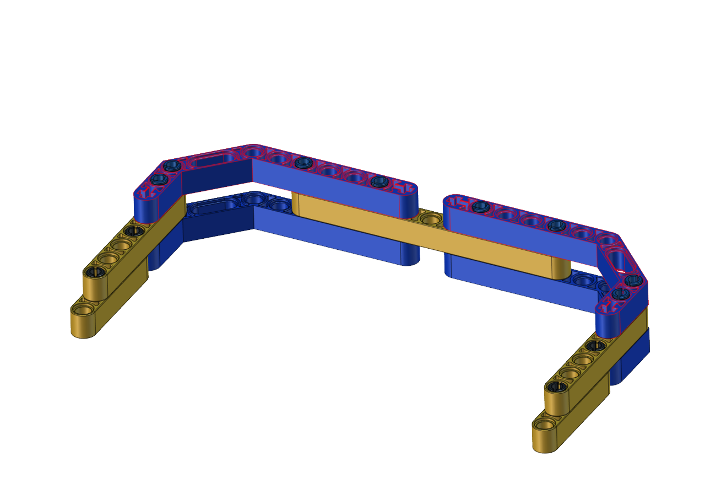

# Install a soccer goal

## Step 1                                                                 
### Required Parts

------

------

------

​                               

## Step 2

Required Parts

------

------

------

## Step 3
Required Parts

------

------

------

Then the soccer goal is installed well.