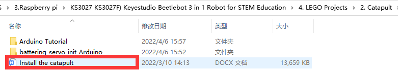
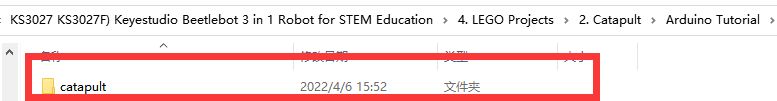

**Catapult**

1.  **Description：**

A catapult is a ballistic device used to launch a projectile a great distance without the aid of gunpowder or other propellants – particularly various types of ancient and medieval siege engines. ... We will make a catapult with LEGO building blocks. Equipped with servos and gears, the car has LEGO tower used to carry projectiles.

As the servo rotates to a proper angle then push the long arm backward a projectile will be launched.

1.  **How to build up a catapult**

1.  **Test Code：**

Build up a few target objects with building blocks(object A, B, C, D, E) and keep them in a certain distance away the catapult and connect Wifi.

Click  to make the car to face the object A, hold down the button to drive the catapult to launch a building block.

Then release the button to make the long arm return to the original state. Next, let’s check if the object A is hit by the launched block

You can repeat above steps to hit the object B, C and D
