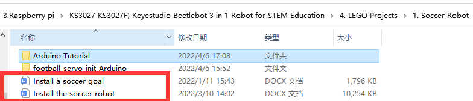
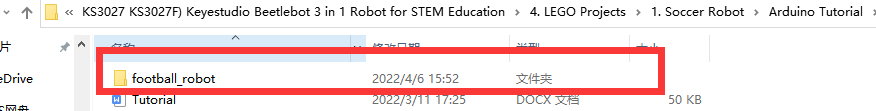

Soccer Robot

1.  **Description：**

    Can you imagine that a robot can play soccer? This idea has became
    realistic. As we know, the RoboCup championship is generally held
    each year. In this part, we will create a soccer robot to play
    soccer.

    **How to install the soccer robot**

    

2.  **Test Code：**

    

    Build up the soccer goal with building blocks and place it at fixed
    location, connect the robot car through Wifi.

    Put a small soccer in the middle of the claw of the robot car, press
    and hold down the button
    to
    enable the claw to hold the soccer, then press buttons
    to
    adjust the car’s movement direction so as to put the soccer close to
    the soccer goal. At last, release the button
    to
    allow the soccer to drop on the floor and roll to the soccer goal.
    If not, repeat the above step to shoot the goal.

    If your friend owns this kind of soccer robot, you guys can hold a
    soccer match. It sounds amazing, right?.
