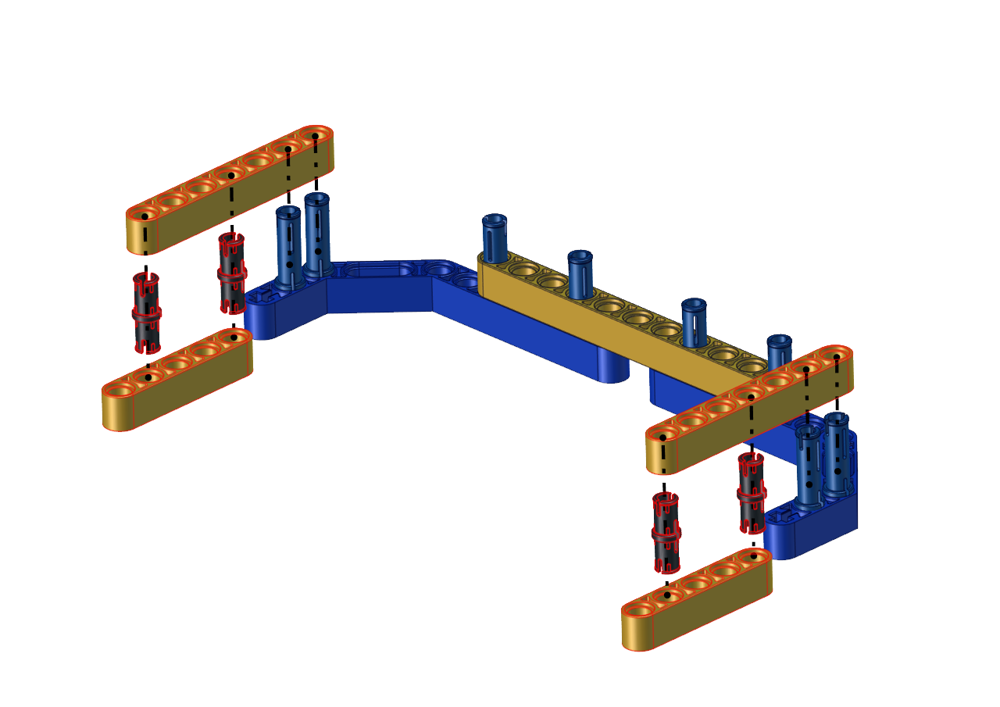

# Install a soccer goal 

<table>
<colgroup>
<col style="width: 23%" />
<col style="width: 76%" />
</colgroup>
<tbody>
<tr class="odd">
<td colspan="2"><h1>Step 1</h1></td>
</tr>
<tr class="even">
<td><h1></h1>
<h1>Required Parts</h1></td>
<td><h1
></h1></td>
</tr>
<tr class="odd">
<td colspan="2">

<h1></h1>
<h1
></h1></td>
</tr>
<tr class="even">
<td colspan="2"><h1>Step 2</h1></td>
</tr>
<tr class="odd">
<td><h1></h1>
<h1>Required Parts</h1></td>
<td><h1
></h1></td>
</tr>
<tr class="even">
<td colspan="2"><h1></h1>
<h1
></h1>
<h1></h1>
<h1></h1>
<h1
></h1></td>
</tr>
<tr class="odd">
<td colspan="2"><h1>Step 3</h1></td>
</tr>
<tr class="even">
<td><h1></h1>
<h1></h1>
<h1>Required Parts</h1></td>
<td><h1
></h1></td>
</tr>
<tr class="odd">
<td colspan="2"><h1
></h1>
<h1></h1>
<h1></h1>
<h1
></h1>

Then the soccer goal is installed well.
</td>
</tr>
</tbody>
</table>

# 
