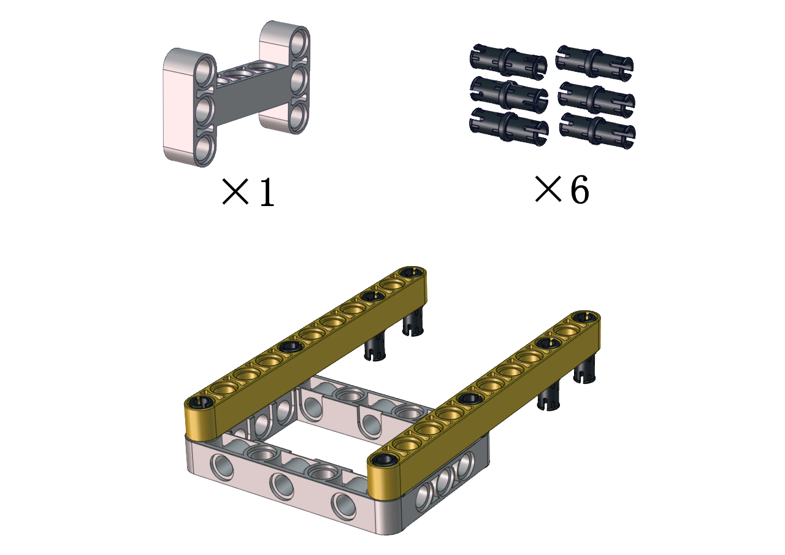
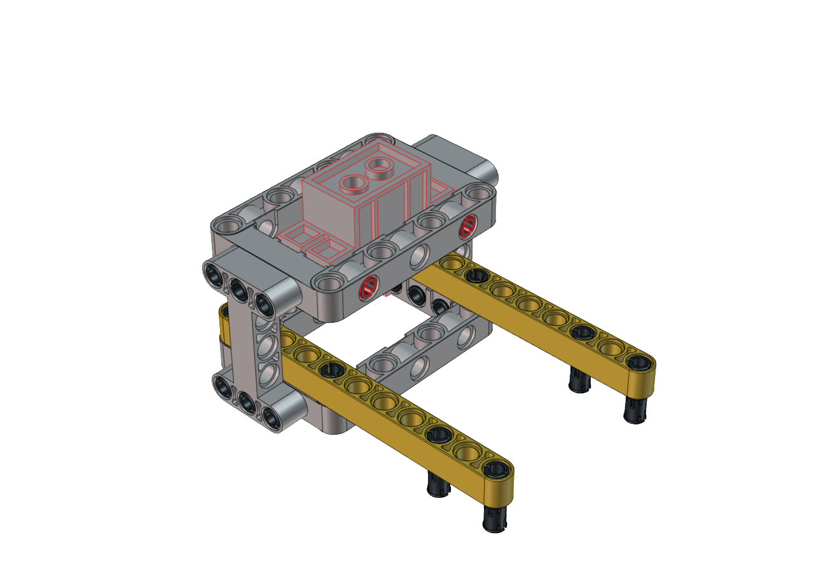
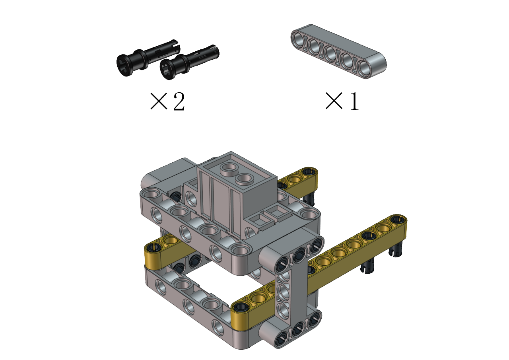
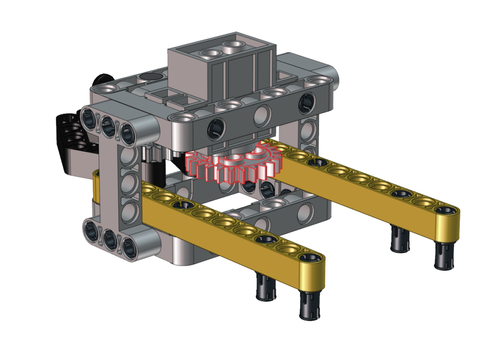
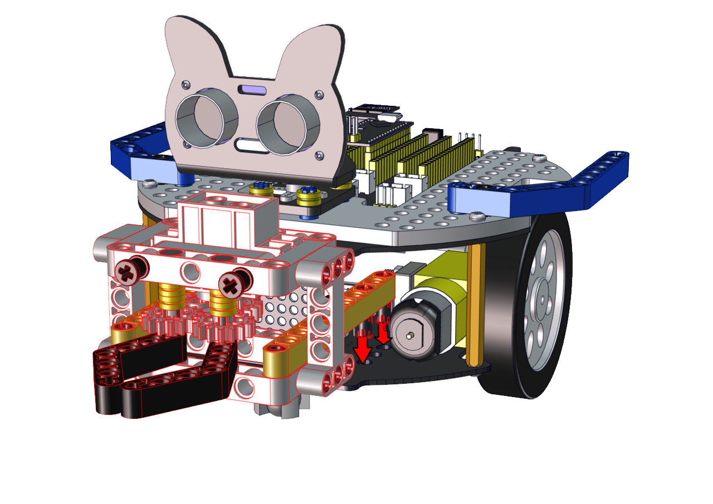
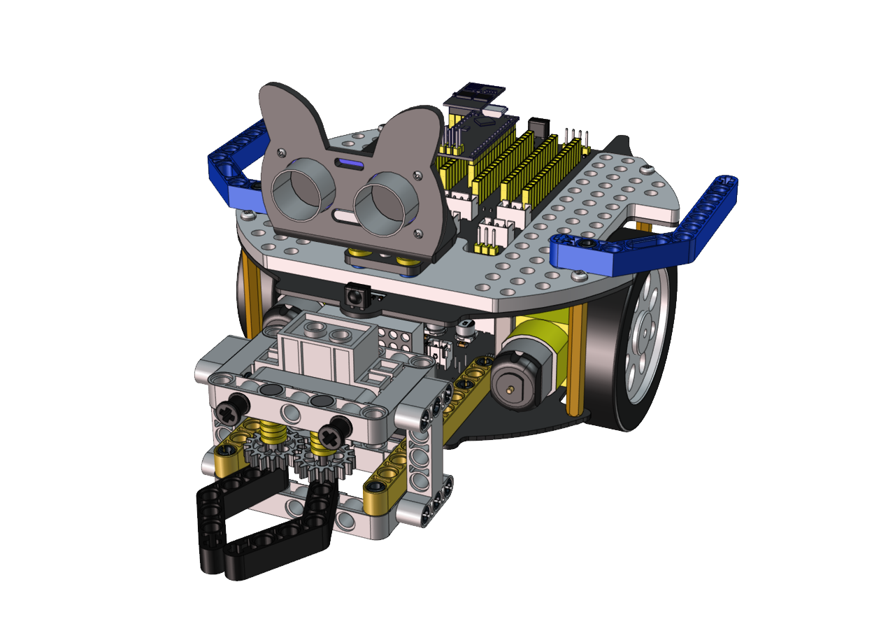

<table>
<colgroup>
<col style="width: 30%" />
<col style="width: 69%" />
</colgroup>
<tbody>
<tr class="odd">
<td colspan="2"><h1><strong>Install the
soccer robot</strong></h1></td>
</tr>
<tr class="even">
<td colspan="2"><h1>Step 1</h1></td>
</tr>
<tr class="odd">
<td>Remove two photoresistors</td>
<td><h1
></h1></td>
</tr>
<tr class="even">
<td>Required Parts</td>
<td><h1
></h1></td>
</tr>
<tr class="odd">
<td colspan="2"><h1
></h1>
<h1
></h1></td>
</tr>
<tr class="even">
<td colspan="2"><h1>Step 2</h1></td>
</tr>
<tr class="odd">
<td>Required Parts</td>
<td><h1></h1>
<h1></h1></td>
</tr>
<tr class="even">
<td colspan="2"><h1></h1>
<h1></h1></td>
</tr>
<tr class="odd">
<td colspan="2"><h1>Step 3</h1></td>
</tr>
<tr class="even">
<td>Required Parts</td>
<td><h1></h1></td>
</tr>
<tr class="odd">
<td colspan="2"><h1></h1>
<h1></h1></td>
</tr>
<tr class="even">
<td colspan="2"><h1>Step 4</h1></td>
</tr>
<tr class="odd">
<td>Required Parts</td>
<td><h1></h1></td>
</tr>
<tr class="even">
<td colspan="2"><h1></h1>
<h1></h1></td>
</tr>
<tr class="odd">
<td colspan="2"><h1>Step 5</h1></td>
</tr>
<tr class="even">
<td>Required Parts</td>
<td><h1></h1></td>
</tr>
<tr class="odd">
<td colspan="2"><h1></h1>
<h1></h1></td>
</tr>
<tr class="even">
<td colspan="2"><h1>Step 6</h1></td>
</tr>
<tr class="odd">
<td>Required Parts</td>
<td><h1
></h1></td>
</tr>
<tr class="even">
<td colspan="2">
Note the installation direction of the part marked by
the red circle

<h1
></h1>
<h1
></h1></td>
</tr>
<tr class="odd">
<td colspan="2"><h1>Step 7</h1></td>
</tr>
<tr class="even">
<td>Required Parts</td>
<td><h1
></h1></td>
</tr>
<tr class="odd">
<td colspan="2"><h1
></h1>
<h1
></h1></td>
</tr>
<tr class="even">
<td colspan="2"><h1>Step 8</h1></td>
</tr>
<tr class="odd">
<td>Required Parts</td>
<td><h1
></h1></td>
</tr>
<tr class="even">
<td colspan="2">
Adjust the angle of the claw. Then make it close and
face front

<h1
></h1>
<h1
></h1></td>
</tr>
<tr class="odd">
<td colspan="2"><h1>Step 9</h1></td>
</tr>
<tr class="even">
<td>Required Parts</td>
<td><h1
></h1></td>
</tr>
<tr class="odd">
<td>Set the angle of the servo to 180 degree</td>
<td><h1>Wire Up</h1>
<table>
<colgroup>
<col style="width: 49%" />
<col style="width: 50%" />
</colgroup>
<tbody>
<tr class="odd">
<td>Servo</td>
<td>PCB Board</td>
</tr>
<tr class="even">
<td>Brown</td>
<td>G</td>
</tr>
<tr class="odd">
<td>Red</td>
<td>5V</td>
</tr>
<tr class="even">
<td>Orange</td>
<td>S2（GPIO23）</td>
</tr>
</tbody>
</table>

Upload the code of the servo to the main board of the Beetlebot car,
as shown below

You can also initialize the angle of the servo through the following
code

Check the Scratch-KidsBlock code as follows，then upload the code to
the main board of the Beetlebot car

</td>
</tr>
<tr class="even">
<td>Keep the claw close and face front before installing the gear</td>
<td><h1
></h1></td>
</tr>
<tr class="odd">
<td></td>
<td><h1
></h1></td>
</tr>
<tr class="even">
<td colspan="2"><h1>Step 10</h1></td>
</tr>
<tr class="odd">
<td>Required Parts</td>
<td><h1
></h1></td>
</tr>
<tr class="even">
<td colspan="2"><h1
></h1>
<h1
></h1></td>
</tr>
<tr class="odd">
<td colspan="2"><h1>Step 11</h1></td>
</tr>
<tr class="even">
<td>Required Parts</td>
<td><h1></h1>
<h1
></h1></td>
</tr>
<tr class="odd">
<td colspan="2"><h1
></h1>
<h1
></h1></td>
</tr>
<tr class="even">
<td colspan="2"><h1
></h1></td>
</tr>
<tr class="odd">
<td colspan="2"><h1>Wiring Diagram</h1></td>
</tr>
<tr class="even">
<td>Wire up the LEGO servo</td>
<td><h1></h1></td>
</tr>
</tbody>
</table>

# 
