<table>
<colgroup>
<col style="width: 32%" />
<col style="width: 67%" />
</colgroup>
<tbody>
<tr class="odd">
<td colspan="2"><h1><strong>How to install the catapult</strong></h1></td>
</tr>
<tr class="even">
<td colspan="2"><h1>Step 1</h1></td>
</tr>
<tr class="odd">
<td colspan="2">
Required components

<h1></h1>
<h1></h1>
<h1></h1></td>
</tr>
<tr class="even">
<td colspan="2"><h1>Step 2</h1></td>
</tr>
<tr class="odd">
<td colspan="2"><h1>Required components</h1>
<h1></h1>
<h1></h1>
<h1></h1></td>
</tr>
<tr class="even">
<td colspan="2"><h1>Step 3</h1></td>
</tr>
<tr class="odd">
<td colspan="2">
Required components

<h1></h1>
<h1></h1>
<h1></h1></td>
</tr>
<tr class="even">
<td colspan="2"><h1>Step 4</h1></td>
</tr>
<tr class="odd">
<td colspan="2">
Required components

<h1></h1>
<h1></h1>
<h1></h1></td>
</tr>
<tr class="even">
<td colspan="2"><h1>Step 5</h1></td>
</tr>
<tr class="odd">
<td colspan="2">
Required components

<h1></h1>
<h1>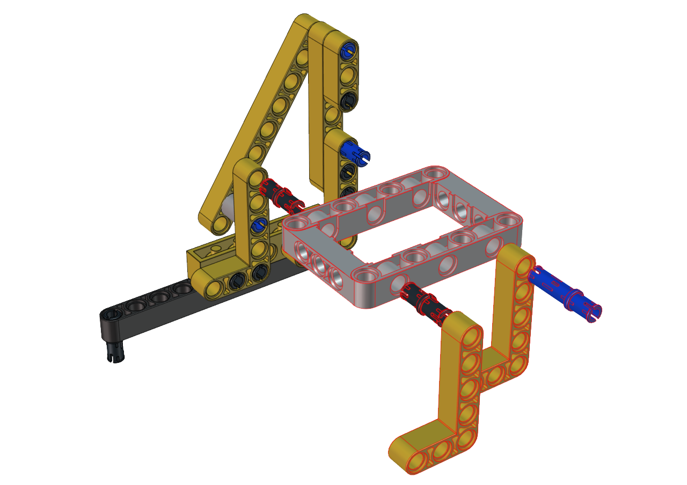</h1>
<h1></h1></td>
</tr>
<tr class="even">
<td colspan="2"><h1>Step 6</h1></td>
</tr>
<tr class="odd">
<td colspan="2">
Required components

<h1></h1>
<h1>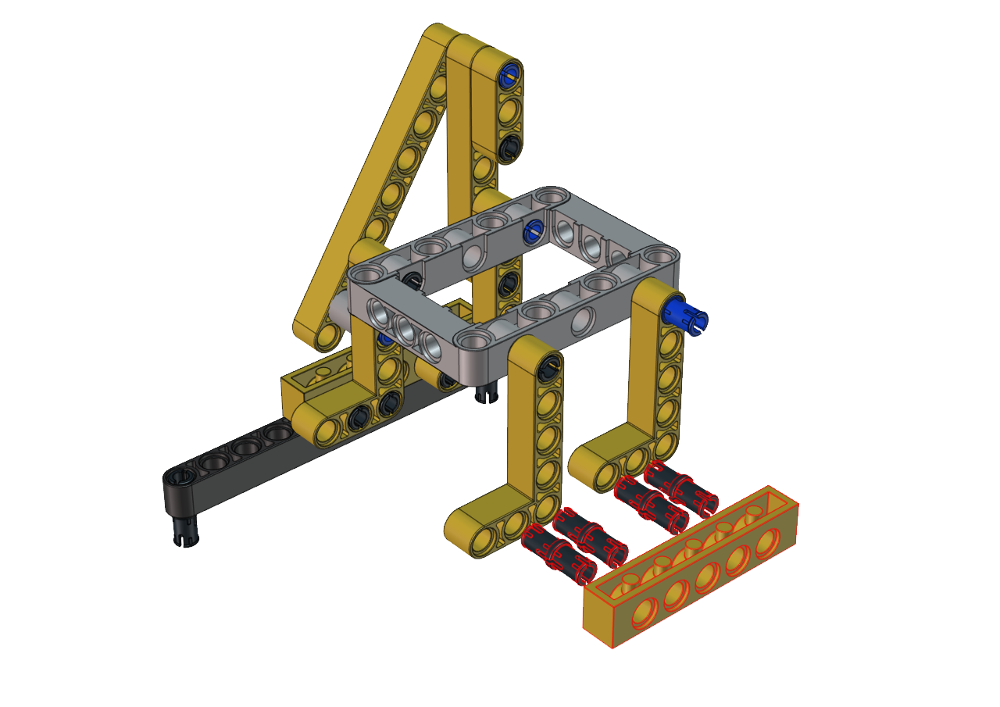</h1>
<h1>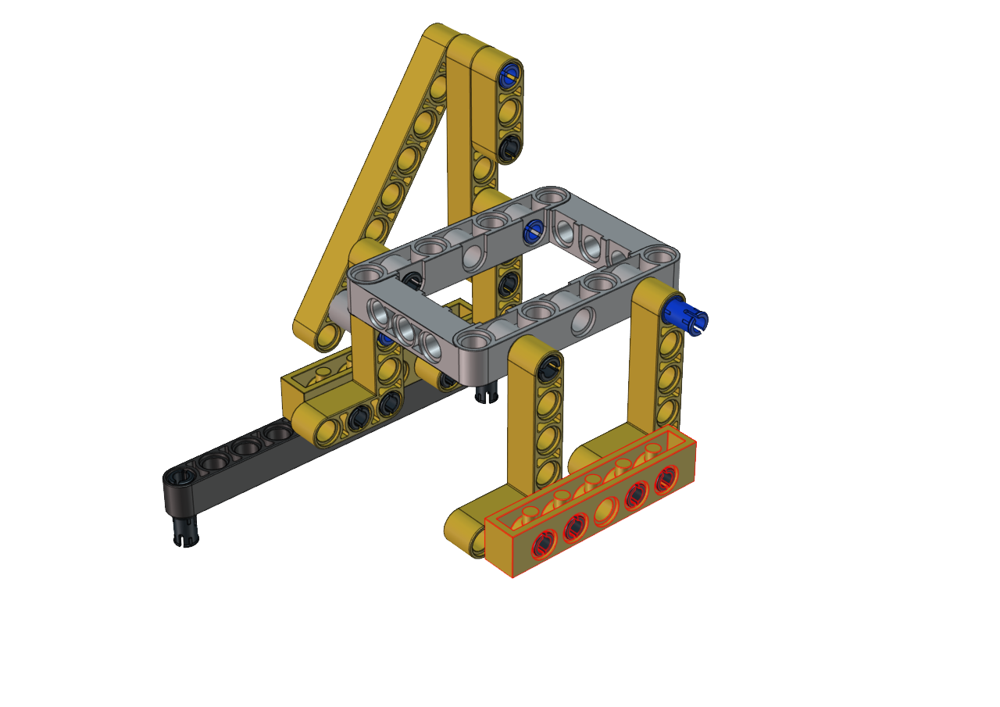</h1></td>
</tr>
<tr class="even">
<td colspan="2"><h1>Step 7</h1></td>
</tr>
<tr class="odd">
<td colspan="2">
Required components

<h1>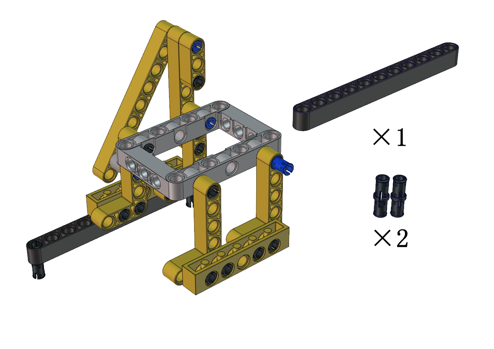</h1>
<h1></h1>
<h1></h1></td>
</tr>
<tr class="even">
<td colspan="2"><h1>Step 8</h1></td>
</tr>
<tr class="odd">
<td colspan="2">
Required components

<h1></h1>
<h1></h1>
<h1></h1></td>
</tr>
<tr class="even">
<td colspan="2"><h1>Step 9</h1></td>
</tr>
<tr class="odd">
<td colspan="2">
Required components

<h1></h1>
<h1></h1>
<h1>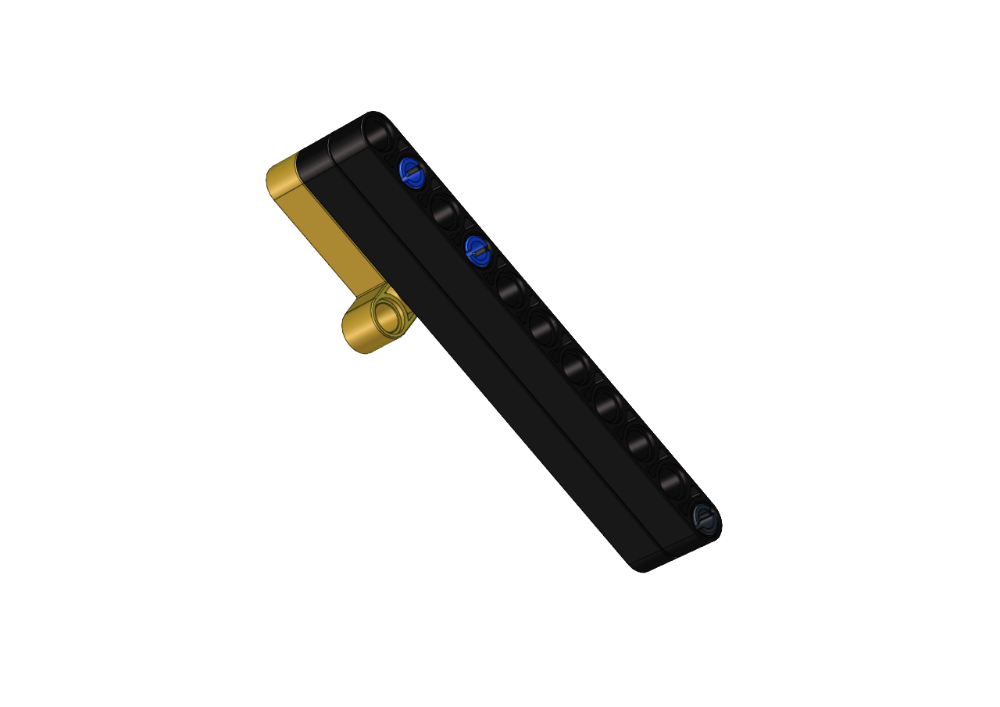</h1></td>
</tr>
<tr class="even">
<td colspan="2"><h1>Step 10</h1></td>
</tr>
<tr class="odd">
<td colspan="2">
Required components

<h1></h1>
<h1>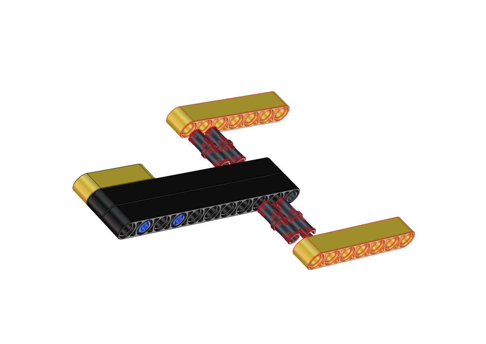</h1>
<h1></h1></td>
</tr>
<tr class="even">
<td colspan="2"><h1>Step 11</h1></td>
</tr>
<tr class="odd">
<td colspan="2">
Required components

<h1
></h1>
<h1
>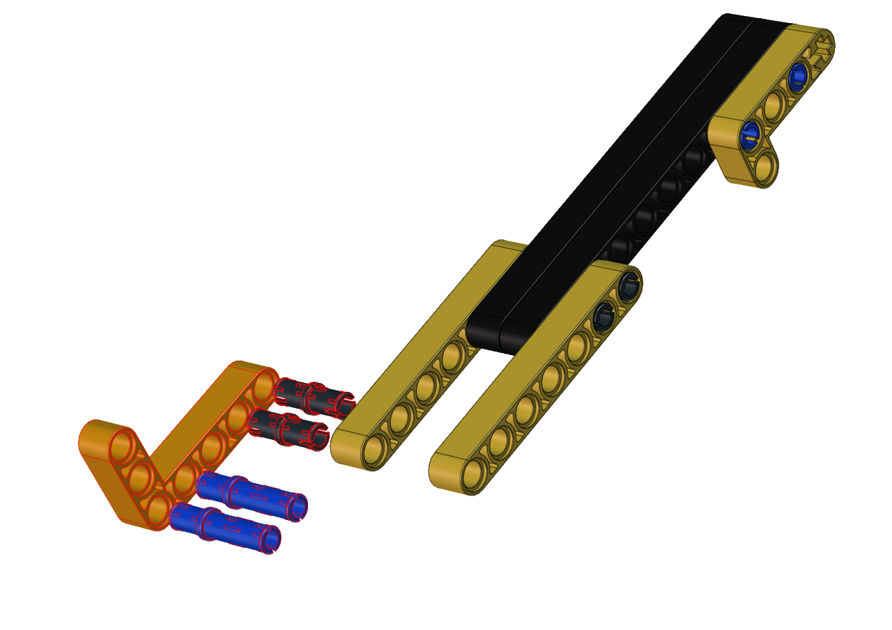</h1>
<h1
></h1></td>
</tr>
<tr class="even">
<td colspan="2"><h1>Step 12</h1></td>
</tr>
<tr class="odd">
<td colspan="2">
Required components

<h1
></h1>
<h1
>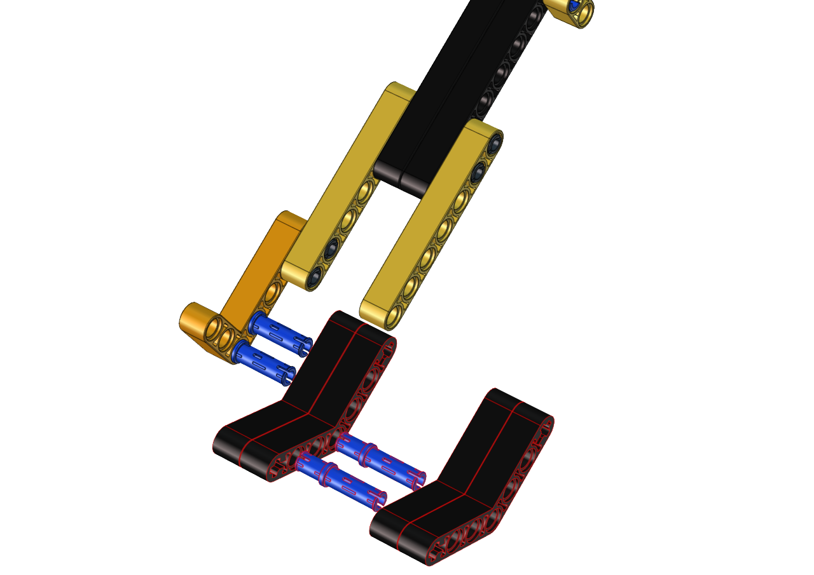</h1>
<h1
></h1></td>
</tr>
<tr class="even">
<td colspan="2"><h1>Step 13</h1></td>
</tr>
<tr class="odd">
<td colspan="2">
Required components

<h1
></h1>
<h1
></h1>
<h1
></h1></td>
</tr>
<tr class="even">
<td colspan="2"><h1>Step 14</h1></td>
</tr>
<tr class="odd">
<td colspan="2">
Required components

<h1
></h1>
<h1
></h1>
<h1
></h1></td>
</tr>
<tr class="even">
<td colspan="2"><h1>Step 15</h1></td>
</tr>
<tr class="odd">
<td colspan="2">
Required components

<h1
>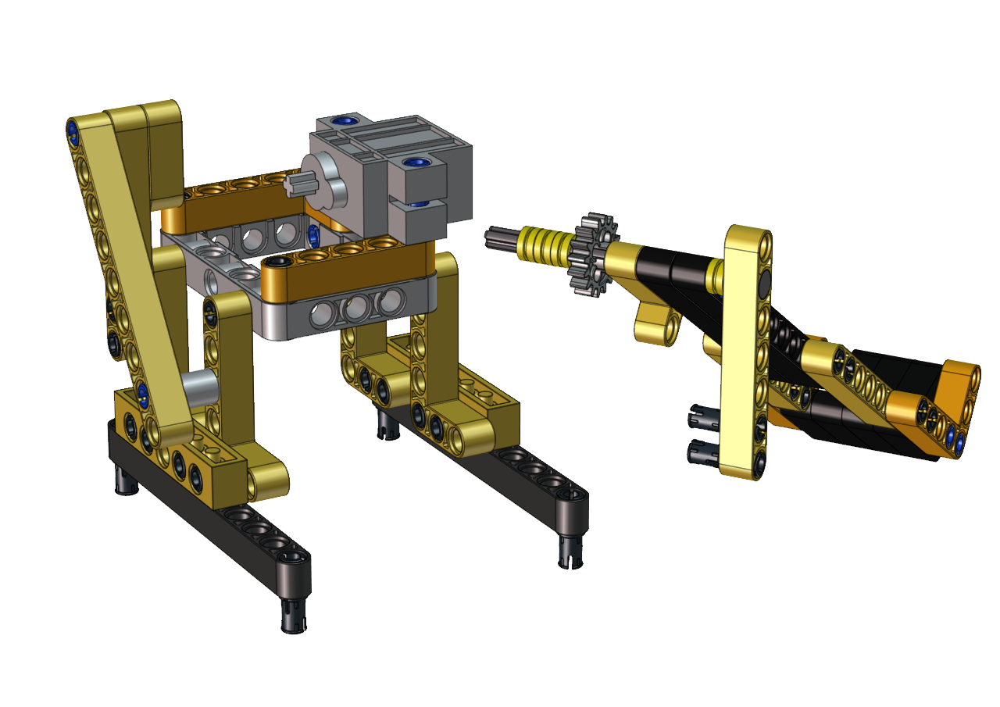</h1>
<h1
></h1>
<h1
></h1></td>
</tr>
<tr class="even">
<td colspan="2"><h1>Step 16</h1></td>
</tr>
<tr class="odd">
<td colspan="2">
Required components

<h1
></h1>
<h1
>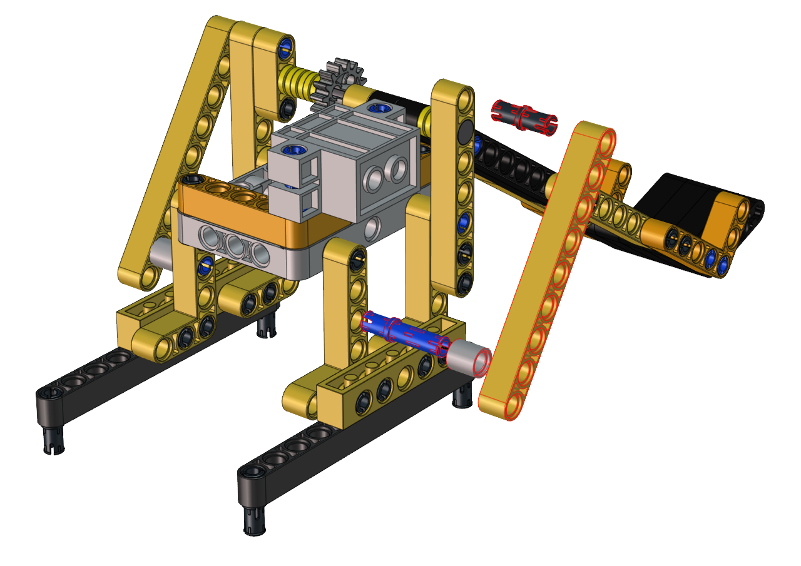</h1>
<h1
></h1></td>
</tr>
<tr class="even">
<td colspan="2"><h1>Step 17</h1></td>
</tr>
<tr class="odd">
<td>Required components</td>
<td><h1></h1></td>
</tr>
<tr class="even">
<td>Set the angle of the servo to 180 degree</td>
<td><h1>Wire servo up</h1>
<table>
<colgroup>
<col style="width: 49%" />
<col style="width: 50%" />
</colgroup>
<tbody>
<tr class="odd">
<td>Servo</td>
<td>PCB Board</td>
</tr>
<tr class="even">
<td>Brown</td>
<td>G</td>
</tr>
<tr class="odd">
<td>Red</td>
<td>5V</td>
</tr>
<tr class="even">
<td>Orange</td>
<td>S2（GPIO23）</td>
</tr>
</tbody>
</table>

Upload the code of the servo to the main board of the Beetlebot car,
as shown below

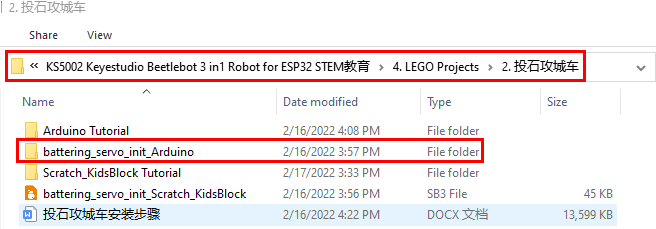

You can also initialize the angle of the servo through the following
code

Check the Scratch-KidsBlock code as follows，then upload the code to
the main board of the Beetlebot car

</td>
</tr>
<tr class="odd">
<td colspan="2"><h1></h1>
<h1></h1></td>
</tr>
<tr class="even">
<td colspan="2"><h1>Step 18</h1></td>
</tr>
<tr class="odd">
<td colspan="2">
Required components

<h1></h1>
<h1>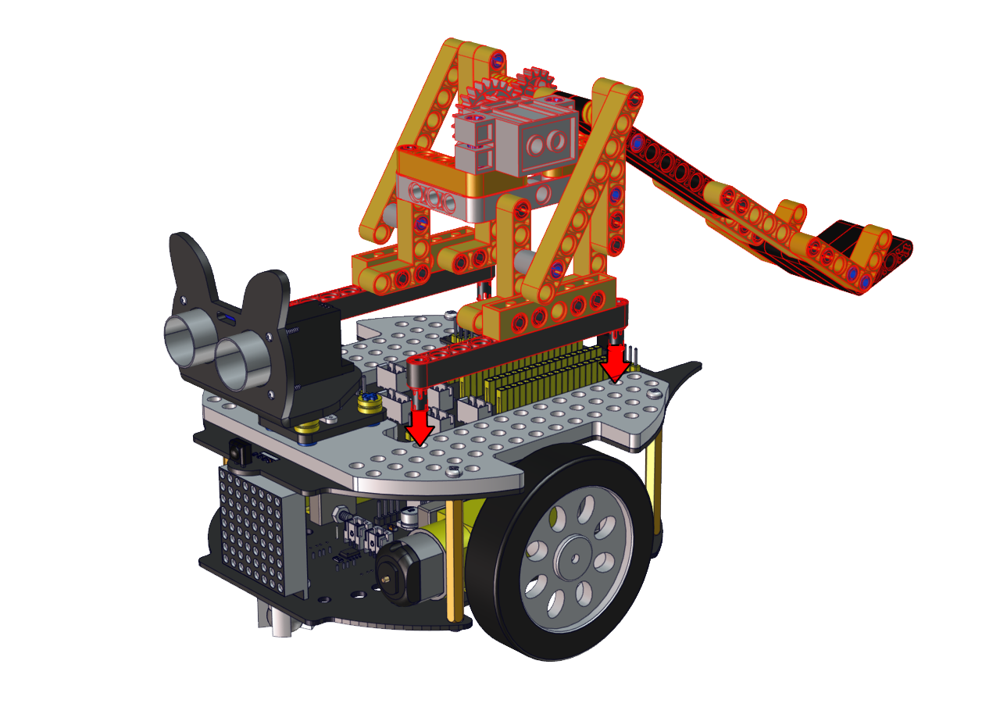</h1>
<h1></h1></td>
</tr>
<tr class="even">
<td colspan="2"><h1>Wire up</h1></td>
</tr>
<tr class="odd">
<td>Interface the servo</td>
<td><h1>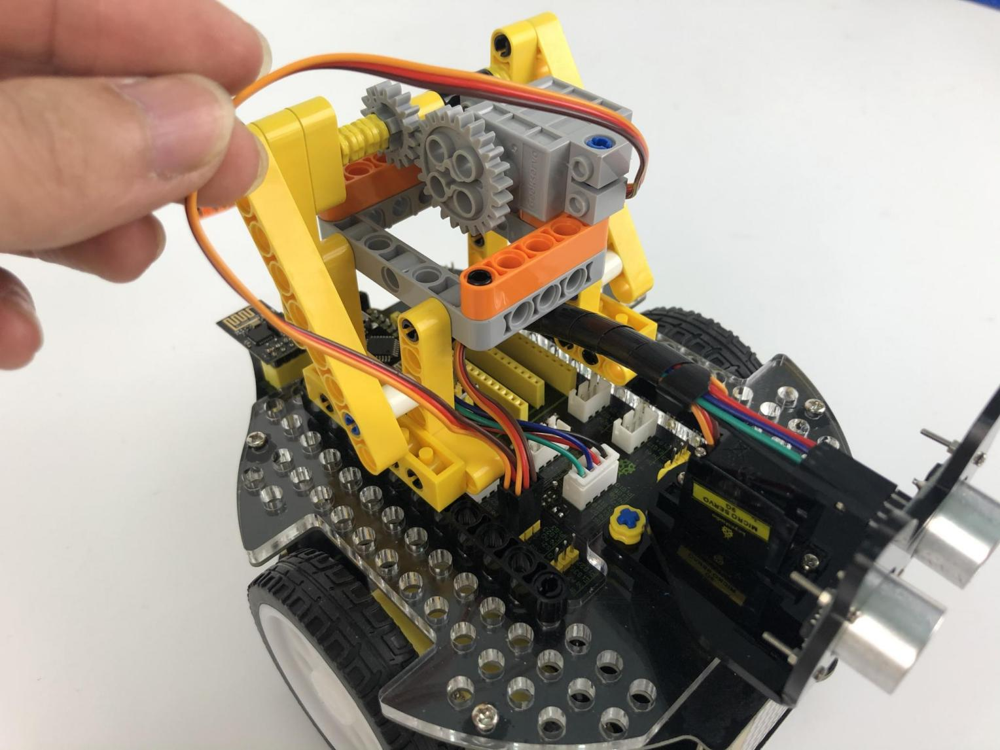</h1></td>
</tr>
</tbody>
</table>
