<table>
<colgroup>
<col style="width: 25%" />
<col style="width: 74%" />
</colgroup>
<tbody>
<tr class="odd">
<td colspan="2"><h1>How toinstall the handling robot</h1></td>
</tr>
<tr class="even">
<td colspan="2"><h1>Step 1</h1></td>
</tr>
<tr class="odd">
<td>Dismantle the ultrasonic sensor</td>
<td><h1>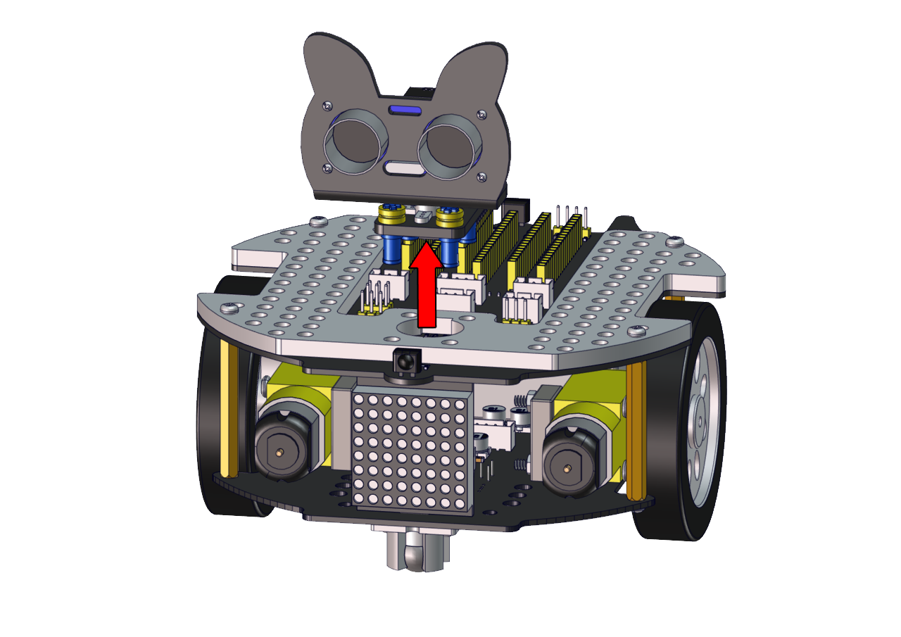</h1></td>
</tr>
<tr class="even">
<td>Required components</td>
<td><h1></h1></td>
</tr>
<tr class="odd">
<td colspan="2"><h1></h1>
<h1></h1></td>
</tr>
<tr class="even">
<td colspan="2"><h1>Step 2</h1></td>
</tr>
<tr class="odd">
<td>Required components</td>
<td><h1></h1></td>
</tr>
<tr class="even">
<td colspan="2"><h1></h1>
<h1></h1></td>
</tr>
<tr class="odd">
<td colspan="2"><h1>Step 3</h1></td>
</tr>
<tr class="even">
<td>Required components</td>
<td><h1></h1></td>
</tr>
<tr class="odd">
<td colspan="2"><h1>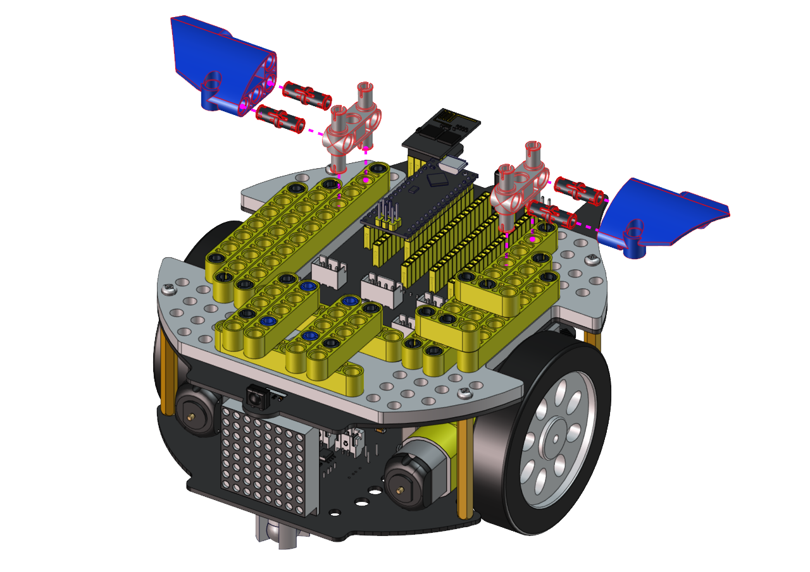</h1>
<h1>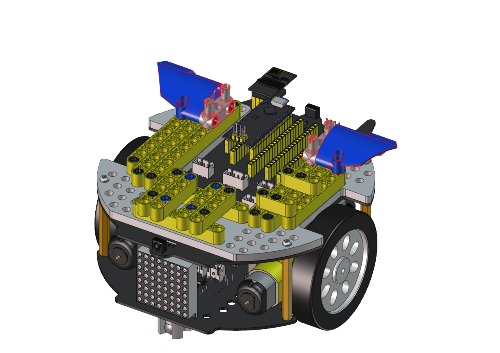<h1>

<tr class="even">
<td colspan="2"><h1>Step 4</h1></td>
</tr>
<tr class="odd">
<td>Required components</td>
<td><h1>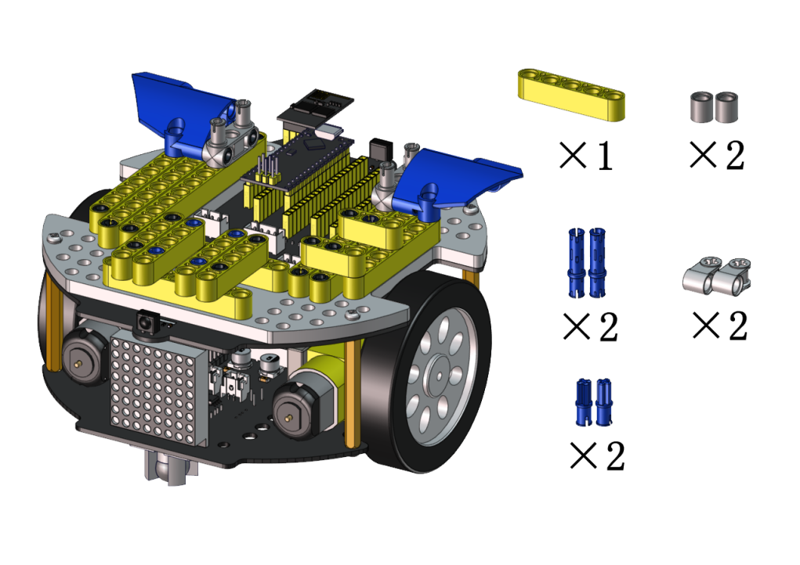</h1></td>
</tr>
<tr class="even">
<td colspan="2"><h1></h1>
<h1>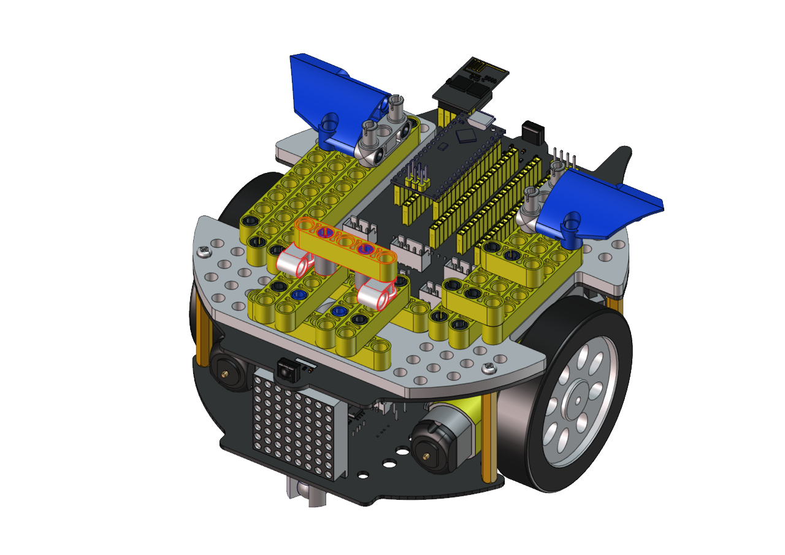</h1></td>
</tr>
<tr class="odd">
<td colspan="2"><h1>Step 5</h1></td>
</tr>
<tr class="even">
<td>Required components</td>
<td><h1></h1></td>
</tr>
<tr class="odd">
<td colspan="2"><h1></h1>
<h1></h1></td>
</tr>
<tr class="even">
<td colspan="2"><h1>Step 6</h1></td>
</tr>
<tr class="odd">
<td>Required components</td>
<td><h1></h1></td>
</tr>
<tr class="even">
<td colspan="2">

<h1></h1></td>
</tr>
<tr class="odd">
<td colspan="2"><h1>Step 7</h1></td>
</tr>
<tr class="even">
<td>Required components</td>
<td><h1></h1></td>
</tr>
<tr class="odd">
<td colspan="2"><h1></h1>
<h1>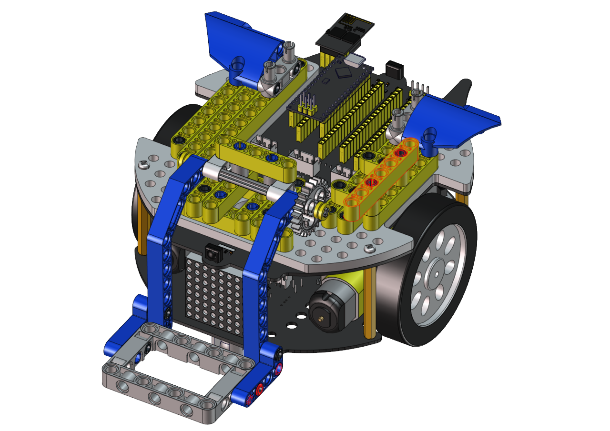</h1></td>
</tr>
<tr class="even">
<td colspan="2"><h1>Step 8</h1></td>
</tr>
<tr class="odd">
<td>Required components</td>
<td><h1></h1>

<td>
</tr>
<tr class="even">
<td colspan="2"><h1></h1>
<h1><h1></td>
</tr>
<tr class="odd">
<td colspan="2"><h1>Step 9</h1></td>
</tr>
<tr class="even">
<td>Required components</td>
<td><h1></h1></td>
</tr>
<tr class="odd">
<td>Set the angle of the servo to 180 degree</td>
<td><h1>Wire servo up</h1>
<table>
<colgroup>
<col style="width: 49%" />
<col style="width: 50%" />
</colgroup>
<tbody>
<tr class="odd">
<td>Servo</td>
<td>PCB Board</td>
</tr>
<tr class="even">
<td>Brown</td>
<td>G</td>
</tr>
<tr class="odd">
<td>Red</td>
<td>5V</td>
</tr>
<tr class="even">
<td>Orange</td>
<td>S2（A0）</td>
</tr>
</tbody>
</table>

Upload the code of the servo to the main board of the Beetlebot car,as shown below

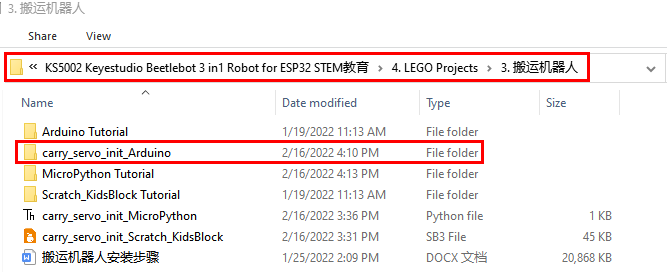

You can also initialize the angle of the servo through the following code

Check the Scratch-KidsBlock code as follows，then upload the code to the main board of the Beetlebot car

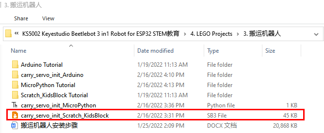
</td>
</tr>
<tr class="even">
<td colspan="2">

<h1></h1>
<h1></h1></td>
</tr>
<tr class="odd">
<td colspan="2"><h1>Step 10</h1></td>
</tr>
<tr class="even">
<td>Required components</td>
<td><h1></h1></td>
</tr>
<tr class="odd">
<td colspan="2"><h1></h1>
<h1></h1>
<h1>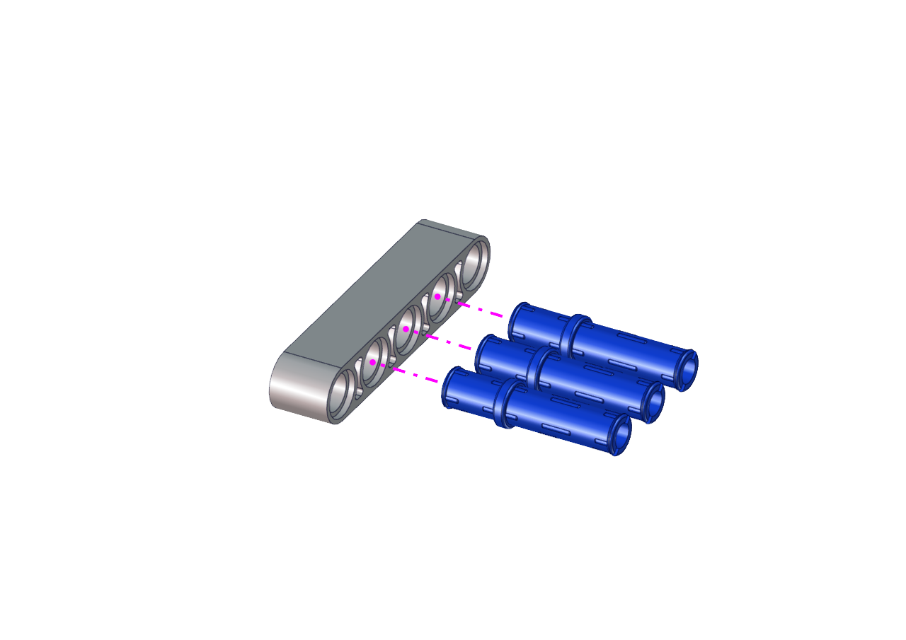</h1>
<h1>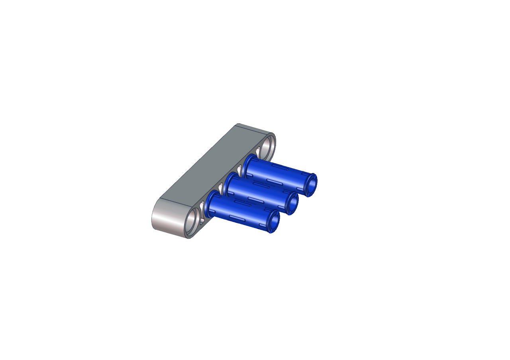</h1>
<h1></h1>
<h1>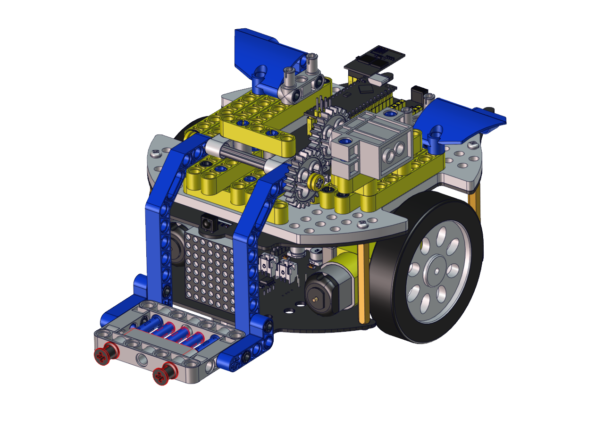</h1></td>
</tr>
<tr class="even">
<td colspan="2"><h1>Wire up servo</h1></td>
</tr>
<tr class="odd">
<td colspan="2">

<h1></h1></td>
</tr>
</tbody>
</table>
