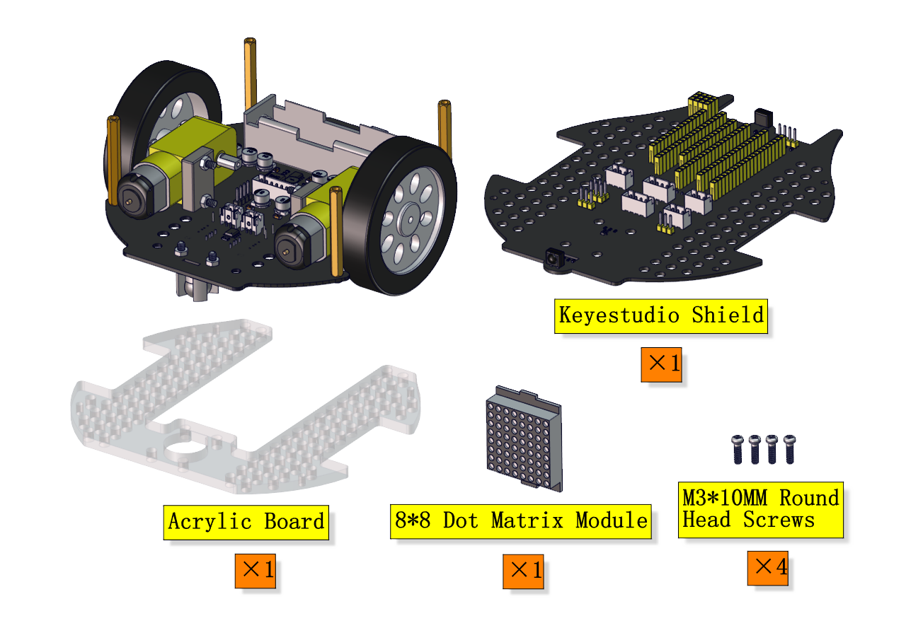
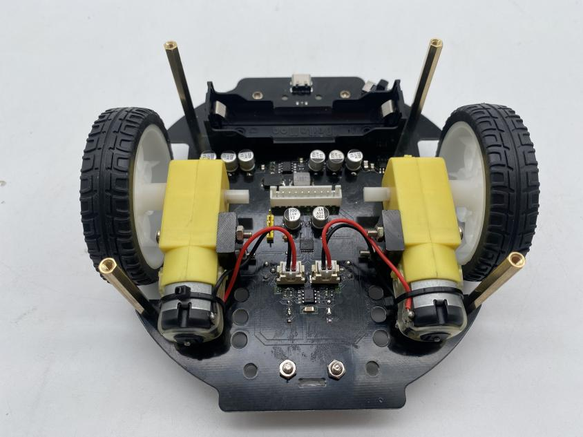
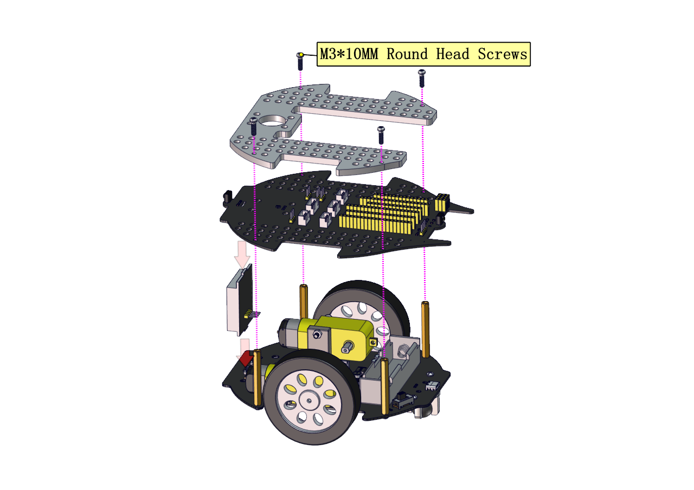
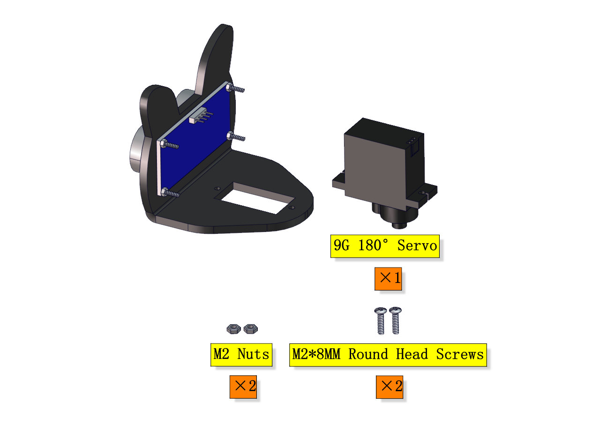

# Beetlebot [Assemble](C:/Users/NINGMEI/AppData/Local/youdao/dict/Application/9.0.1.1/resultui/html/index.html#/javascript:;)Steps 

<table>
<colgroup>
<col style="width: 20%" />
<col style="width: 79%" />
</colgroup>
<tbody>
<tr class="odd">
<td colspan="2"><h1></h1></td>
</tr>
<tr class="even">
<td colspan="2"><h1><strong>Part 1</strong></h1></td>
</tr>
<tr class="odd">
<td><h1></h1>
<h1>Components Needed</h1></td>
<td><h1
></h1></td>
</tr>
<tr class="even">
<td><h1></h1>
<h1>Installation Diagram</h1></td>
<td><h1
></h1></td>
</tr>
<tr class="odd">
<td><h1></h1>
<h1>Prototype</h1></td>
<td><h1
></h1></td>
</tr>
<tr class="even">
<td colspan="2"><h1><strong>Part 2</strong></h1></td>
</tr>
<tr class="odd">
<td><h1></h1>
<h1>Components Needed</h1></td>
<td><h1
></h1></td>
</tr>
<tr class="even">
<td><h1></h1>
<h1></h1>
<h1>Installation Diagram</h1></td>
<td><h1
></h1></td>
</tr>
<tr class="odd">
<td><h1></h1>
<h1></h1>
<h1>Prototype</h1></td>
<td><h1
></h1></td>
</tr>
<tr class="even">
<td colspan="2"><h1><strong>Part 3</strong></h1></td>
</tr>
<tr class="odd">
<td><h1></h1>
<h1>Components Needed</h1></td>
<td><h1></h1>
<h1></h1></td>
</tr>
<tr class="even">
<td><h1></h1>
<h1></h1>
<h1></h1>
<h1></h1>
<h1>Installation Diagram</h1></td>
<td><h1></h1></td>
</tr>
<tr class="odd">
<td><h1></h1>
<h1></h1>
<h1>Prototype</h1></td>
<td><h1></h1></td>
</tr>
<tr class="even">
<td colspan="2"><h1><strong>Part 4</strong></h1></td>
</tr>
<tr class="odd">
<td><h1></h1>
<h1>Components Needed</h1></td>
<td><h1
></h1></td>
</tr>
<tr class="even">
<td><h1></h1>
<h1></h1>
<h1></h1>
<h1></h1>
<h1>Installation Diagram</h1></td>
<td><h1
></h1></td>
</tr>
<tr class="odd">
<td><h1></h1>
<h1></h1>
<h1>Prototype</h1></td>
<td><h1
></h1></td>
</tr>
<tr class="even">
<td colspan="2"><h1><strong>Part 5</strong></h1></td>
</tr>
<tr class="odd">
<td><h1></h1>
<h1>Components Needed</h1></td>
<td><h1
></h1></td>
</tr>
<tr class="even">
<td>Connect the wiring of the motor, 8*8 dot matrix and pcb boards</td>
<td><table>
<colgroup>
<col style="width: 49%" />
<col style="width: 50%" />
</colgroup>
<tbody>
<tr class="odd">
<td>Left motor</td>
<td>Right motor</td>
</tr>
<tr class="even">
<td>L</td>
<td>R</td>
</tr>
</tbody>
</table>
<h1></h1>

<table>
<colgroup>
<col style="width: 49%" />
<col style="width: 50%" />
</colgroup>
<tbody>
<tr class="odd">
<td>8*8 Dot matrix</td>
<td>PCB board</td>
</tr>
<tr class="even">
<td>G</td>
<td>G</td>
</tr>
<tr class="odd">
<td>5V</td>
<td>5V</td>
</tr>
<tr class="even">
<td>SDA</td>
<td>SDA</td>
</tr>
<tr class="odd">
<td>SCL</td>
<td>SCL</td>
</tr>
</tbody>
</table>

</td>
</tr>
<tr class="odd">
<td><h1></h1>
<h1></h1>
<h1></h1>
<h1></h1>
<h1>Installation Diagram</h1></td>
<td><h1
></h1></td>
</tr>
<tr class="even">
<td><h1></h1>
<h1></h1>
<h1>Prototype</h1></td>
<td><h1
></h1></td>
</tr>
<tr class="odd">
<td colspan="2"><h1><strong>Part 6</strong></h1></td>
</tr>
<tr class="even">
<td><h1></h1>
<h1>Components Needed</h1></td>
<td><h1
></h1></td>
</tr>
<tr class="odd">
<td><h1></h1>
<h1></h1>
<h1></h1>
<h1></h1>
<h1>Installation Diagram</h1></td>
<td><h1
></h1></td>
</tr>
<tr class="even">
<td><h1></h1>
<h1></h1>
<h1>Prototype</h1></td>
<td><h1
></h1></td>
</tr>
<tr class="odd">
<td colspan="2"><h1><strong>Part 7</strong></h1></td>
</tr>
<tr class="even">
<td><h1></h1>
<h1>Components Needed</h1></td>
<td><h1
></h1></td>
</tr>
<tr class="odd">
<td><h1></h1>
<h1></h1>
<h1></h1>
<h1></h1>
<h1>Installation Diagram</h1></td>
<td><h1
></h1></td>
</tr>
<tr class="even">
<td><h1></h1>
<h1></h1>
<h1>Prototype</h1></td>
<td><h1
></h1></td>
</tr>
<tr class="odd">
<td colspan="2"><h1><strong>Part 8</strong></h1></td>
</tr>
<tr class="even">
<td><h1></h1>
<h1>Components Needed</h1></td>
<td><h1
></h1></td>
</tr>
<tr class="odd">
<td><h1></h1>
<h1></h1>
<h1></h1>
<h1></h1>
<h1>Installation Diagram</h1></td>
<td><h1
></h1></td>
</tr>
<tr class="even">
<td><h1></h1>
<h1></h1>
<h1>Prototype</h1></td>
<td><h1
></h1></td>
</tr>
<tr class="odd">
<td colspan="2"><h1><strong>Part 9</strong></h1></td>
</tr>
<tr class="even">
<td><h1></h1>
<h1>Components Needed</h1></td>
<td><h1
></h1></td>
</tr>
<tr class="odd">
<td>Set the servo to 90° before installation</td>
<td><table>
<colgroup>
<col style="width: 49%" />
<col style="width: 50%" />
</colgroup>
<tbody>
<tr class="odd">
<td>Servo</td>
<td>PCB board</td>
</tr>
<tr class="even">
<td>Brown <mark>wire</mark></td>
<td>G</td>
</tr>
<tr class="odd">
<td>Red <mark>wire</mark></td>
<td>5V</td>
</tr>
<tr class="even">
<td><mark>Orange wire</mark></td>
<td><mark>S1（G9）</mark></td>
</tr>
</tbody>
</table>
<h1></h1>

<mark>The above code is provided in the tutorial, open the
initialization code of the servo and burn it to the Beetlebot's
motherboard, as shown below:</mark>

</td>
</tr>
<tr class="even">
<td>After adjustment, mount it forward</td>
<td><h1
></h1></td>
</tr>
<tr class="odd">
<td><h1></h1>
<h1></h1>
<h1>Prototype</h1></td>
<td><h1
></h1></td>
</tr>
<tr class="even">
<td colspan="2"><h1><strong>Part 10</strong></h1></td>
</tr>
<tr class="odd">
<td><h1></h1>
<h1>Components Needed</h1></td>
<td><h1
></h1></td>
</tr>
<tr class="even">
<td><h1></h1>
<h1></h1>
<h1></h1>
<h1></h1>
<h1>Installation Diagram</h1></td>
<td><h1
></h1></td>
</tr>
<tr class="odd">
<td><h1></h1>
<h1></h1>
<h1>Prototype</h1></td>
<td><h1
></h1></td>
</tr>
<tr class="even">
<td colspan="2"><h1><strong>Part 11</strong></h1></td>
</tr>
<tr class="odd">
<td><h1></h1>
<h1>Components Needed</h1></td>
<td><h1
></h1></td>
</tr>
<tr class="even">
<td><h1></h1>
<h1></h1>
<h1></h1>
<h1></h1>
<h1>Installation Diagram</h1></td>
<td><h1
></h1></td>
</tr>
<tr class="odd">
<td><h1></h1>
<h1></h1>
<h1>Prototype</h1></td>
<td><h1
></h1></td>
</tr>
<tr class="even">
<td colspan="2"><h1><strong>Part 12</strong></h1></td>
</tr>
<tr class="odd">
<td><h1></h1>
<h1>Components Needed</h1></td>
<td><h1
></h1></td>
</tr>
<tr class="even">
<td><h1></h1>
<h1></h1>
<h1></h1>
<h1></h1>
<h1>Installation Diagram</h1></td>
<td><h1
></h1></td>
</tr>
<tr class="odd">
<td><h1></h1>
<h1></h1>
<h1>Prototype</h1></td>
<td><h1
></h1></td>
</tr>
<tr class="even">
<td>Complete installation</td>
<td><h1
></h1></td>
</tr>
<tr class="odd">
<td colspan="2"><h1><strong>Wiring
Diagram</strong></h1></td>
</tr>
<tr class="even">
<td>Wiring Diagram of Ultrasonic sensor</td>
<td><table>
<colgroup>
<col style="width: 49%" />
<col style="width: 50%" />
</colgroup>
<tbody>
<tr class="odd">
<td>Ultrasonic sensor</td>
<td>PCB board</td>
</tr>
<tr class="even">
<td>Vcc</td>
<td>5V</td>
</tr>
<tr class="odd">
<td>Trig</td>
<td><mark>S2（G10）</mark></td>
</tr>
<tr class="even">
<td>Echo</td>
<td><mark>S1（G11）</mark></td>
</tr>
<tr class="odd">
<td>Gnd</td>
<td>G</td>
</tr>
</tbody>
</table>
<h1></h1></td>
</tr>
<tr class="odd">
<td>Wiring Diagram of servo</td>
<td><table>
<colgroup>
<col style="width: 49%" />
<col style="width: 50%" />
</colgroup>
<tbody>
<tr class="odd">
<td>Servo</td>
<td>PCB board</td>
</tr>
<tr class="even">
<td>Brown <mark>wire</mark></td>
<td>G</td>
</tr>
<tr class="odd">
<td>Red <mark>wire</mark></td>
<td>5V</td>
</tr>
<tr class="even">
<td><mark>Orange wire</mark></td>
<td><mark>S1（G9）</mark></td>
</tr>
</tbody>
</table>
<h1></h1>

</td>
</tr>
<tr class="even">
<td>Wiring Diagram of left Photoresistor</td>
<td><table>
<colgroup>
<col style="width: 48%" />
<col style="width: 51%" />
</colgroup>
<tbody>
<tr class="odd">
<td>Left Photoresistor</td>
<td>PCB board</td>
</tr>
<tr class="even">
<td>G</td>
<td>G</td>
</tr>
<tr class="odd">
<td>V</td>
<td>V</td>
</tr>
<tr class="even">
<td><mark>S</mark></td>
<td><mark>S（G26）</mark></td>
</tr>
</tbody>
</table>
<h1></h1>

</td>
</tr>
<tr class="odd">
<td>Wiring Diagram of right Photoresistor</td>
<td><table>
<colgroup>
<col style="width: 48%" />
<col style="width: 51%" />
</colgroup>
<tbody>
<tr class="odd">
<td>Right Photoresistor</td>
<td>PCB board</td>
</tr>
<tr class="even">
<td>G</td>
<td>G</td>
</tr>
<tr class="odd">
<td>V</td>
<td>V</td>
</tr>
<tr class="even">
<td><mark>S</mark></td>
<td><mark>S（G27）</mark></td>
</tr>
</tbody>
</table>
<h1></h1></td>
</tr>
<tr class="even">
<td>Complete installation</td>
<td><h1></h1></td>
</tr>
</tbody>
</table>

