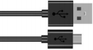
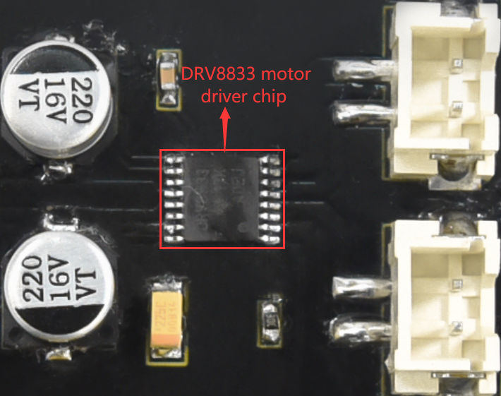
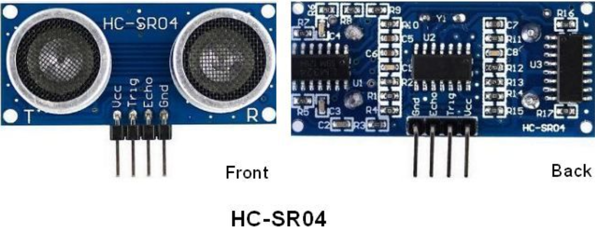
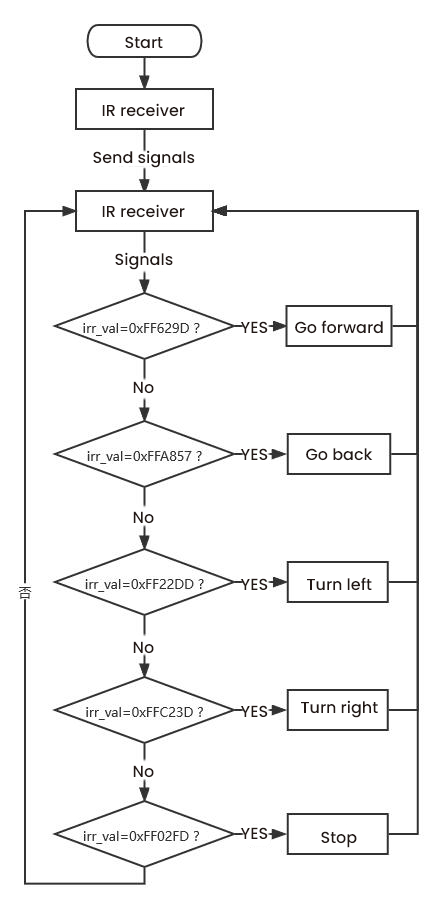
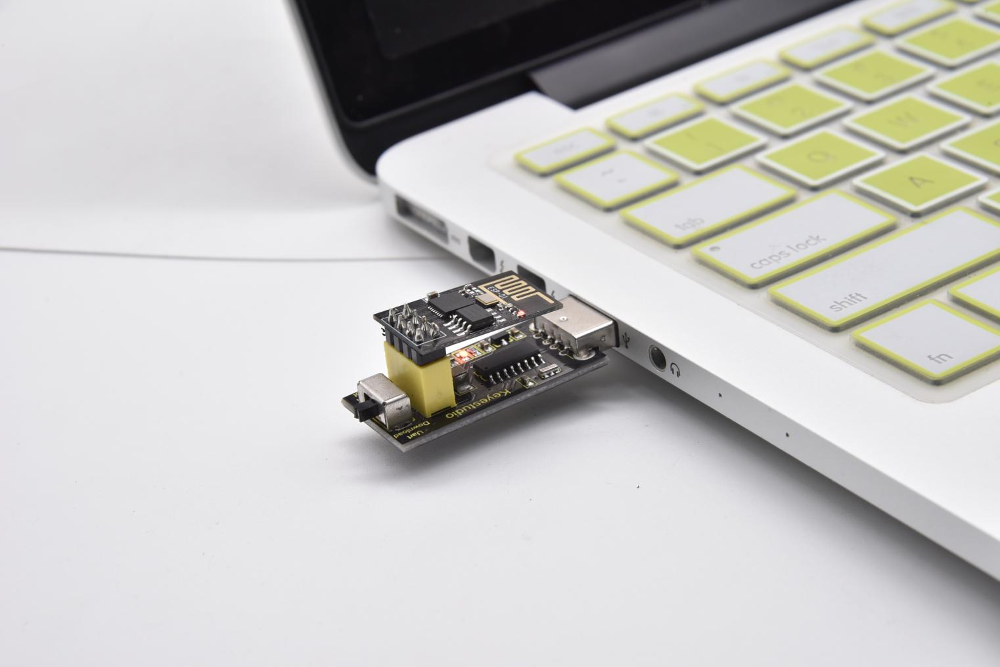
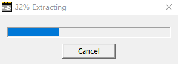

# Arduino C Tutorial

## Get started with Arduino

### Windows System


#### Installing Arduino IDE

When you get control board, you need to download Arduino IDE and driver firstly.

You could download Arduino IDE from the official website:

<https://www.arduino.cc/>, click the **SOFTWARE** on the browse bar, click“DOWNLOADS” to enter download page, as shown below:


There are various versions of IDE for Arduino. Just download a version compatible with your system. Here we will show you how to download and install the windows version of Arduino IDE.


There are two versions of IDE for WINDOWS system. You can choose between the installer (.exe) and the Zip file. For installer, it can be directly downloaded, without the need of installing it manually while for Zip package, you will need to install the driver manually.


You just need to click JUST DOWNLOAD.

After the Arduino is downloaded, click“I Agree”to continue installing


Click **Next**


Then click **Install.**


If the following page appears, click **Install.**


A- Used to verify whether there is any compiling mistakes or not.

B- Used to upload the sketch to your Arduino board.

C- Used to create shortcut window of a new sketch.

D- Used to directly open an example sketch.

E- Used to save the sketch.

F- Used to send the serial data received from board to the serial monitor.

#### Install the development board Pico

**Open Arduino IDE and click Tools**→**Board**→**Boards Manager...**


Search **Pico and select Arduino Mbed OS RP2040 Boards and click Install**


Click **Install**


Then click **Close**


#### Upload the pico compatible with Arduino

Disconnect the Raspberry Pi Pico with the computer, press and hold down the white button (BOOTSEL)，then connect the pico board to the computer.

Keep pressing the button before connecting the USB cable to the Pico board, otherwise the firmware can’t be uploaded.


Open Arduino IDE, click **File**→**Examples**→**01.Basics**→**Blink**


**Click Tools**→**Board**→**Arduino Mbed OS RP2040 Boards**→**Raspberry Pi Pico**


Upload the script Blink to the pico board


You can view this when uploading the sketch.


The indicator of the Raspberry Pi Pico starts flashing.

 

Click **Tools**→**Port**→**COMx(Raspberry Pi Pico)**

Select the correct COM port on the computer.

In the following picture, the port is COM 15.


Note

1.  When you upload a sketch of the Raspberry Pi Pico through Arduino, don’t select the port.

Check the port before uploading sketches.

1.  The Raspberry Pi Pico may not work due to code missing.

You can upload the Raspberry Pi Pico's firmware

### Mac System


Download Arduino IDE:


You can refer to the Windows system to operate.


## Projects：

### Project 1: Onboard LED Flashing

**1. Description：**

There is an onboard LED in Raspberry Pi Pico,which is a GP25 pin attached to the Raspberry Pi Pico. In this project, we will learn the effect of making the onboard LED blink.

**2. Components**

|  |  |
|---------------------------------------------------------|-------------------------------------------------|
| Raspberry Pi Pico\*1                                    | USB Cable\*1                                    |

1.  **Wiring up**

In this project, Raspberry Pi Pico is connected to a computer using a USB cable.


1.  **Test Code：**

The onboard LED of Raspberry Pi Pico is controlled by GP25. When the output of GP25 is high, the LED is on; when the output is low, the LED is off.

Enter the folder KS3027 Keyestudio Beetlebot 3 in 1 Robot for Pico STEM Education\\3. C Tutorials\\2. C_Codes\\Project_01_Onboard_LED_Flashing.

```c++
/* Filename : Onboard LED flashing  
* Description : Make an led blinking.  
* Auther : http//www.keyestudio.com 
*/ 
#define LED_BUILTIN 25  // the setup function runs once when you press reset or power the board 
void setup() {  // initialize digital pin LED_BUILTIN as an output.  
	pinMode(LED_BUILTIN, OUTPUT); 
}  // the loop function runs over and over again forever 
void loop() {  
    digitalWrite(LED_BUILTIN, HIGH); // turn the LED on (HIGH is the voltage level)  
    delay(1000); // wait for a second  
    digitalWrite(LED_BUILTIN, LOW); // turn the LED off by making the voltage LOW  
    delay(1000); // wait for a second 
}
```

Before uploading Test Code to Raspberry Pi Pico, please check the configuration of Arduino IDE.

Click "Tools" to confirm that the board type and ports.


Click  to upload the test code to the Raspberry Pi Pico board


**5. Test Result**

After the project code was uploaded successfully, the LED of Raspberry Pi Pico starts flashing

 

### Project 2: 6812 RGB

**1.Description：**

There are four RGB LED on the expansion board of the car. The RGB LED is a simple luminous module, which can adjust the color to bring out the light effect of different colors. It can be widely used in buildings, bridges, roads, gardens, courtyards, floors and other fields of decorative lighting and venue layout, Christmas, Halloween, Valentine's Day, Easter, National Day and other festivals during the atmosphere and other scenes. In this experiment, 4 RGB on the car expansion board are used to achieve various lighting effects.

1.  **Knowledge:**

SK6812RGB: There are four RGB LEDS on the expansion board of the car. It can be seen from the schematic diagram that the four RGBLED are all connected in series. Under the condition of sufficient voltage and current, hundreds of RGB leds can be connected.

Every RGBLED is an independent pixels, each pixel is consist of R, G, B three primary colors, which can realize the class of 256 and complete 16777216 colours of whole true color display, while the pixel contains internal intelligent digital interface data latch signal shaping amplifier drive circuit,and the built-in signal shaping circuit, which effectively ensure the pixel point light color height consistency.


1.  **Add Adafruit NeoPixel library:**

This project code uses a library named "Adafruit_NeoPixel". If you haven't added it yet, please add it before you study. If you want to add a third-party library, please perform the following steps:

Open the Arduino IDE and click“Sketch”→“Include Library”→ “Add.zip Library...”. Find the directory named KS3027 Keyestudio Beetlebot 3 in 1 Robot for Pico STEM Education Car\\3.c Tutorials\\3. Libraries\\ adafruit_neopixel.

Zip file in the pop-up window, select the adafruit_neopixel. Zip file and click“Open”.


**4. Test Code：**

The SK6812RGB on the PCB board is controlled by the GPIO 13.

After the Adafruit_NeoPixel library is added, you can open the code we provided:

Enter the folder KS3027 Keyestudio Beetlebot 3 in 1 Robot for Pico STEM Education\\3. C Tutorials\\2. C_Codes\\2. C_Codes\\Project_02_6812_RGB

```c++
/*  Project 02 SK6812 RGB  4 RGBs for various lighting effects. */
 #include <Adafruit_NeoPixel.h\>
 #define PIN 13  // Parameter 1 = number of pixels in strip
    // Parameter 2 = Arduino pin number (most are valid) 
    // Parameter 3 = pixel type flags, add together as needed: 
    // NEO_KHZ800 800 KHz bitstream (most NeoPixel products w/WS2812 LEDs) 
    // NEO_KHZ400 400 KHz (classic 'v1' (not v2) FLORA pixels, WS2811 drivers) 
    // NEO_GRB Pixels are wired for GRB bitstream (most NeoPixel products) 
    // NEO_RGB Pixels are wired for RGB bitstream (v1 FLORA pixels, not v2) 
Adafruit_NeoPixel strip = Adafruit_NeoPixel(60, PIN, NEO_GRB + NEO_KHZ800);  
// IMPORTANT: To reduce NeoPixel burnout risk, add 1000 uF capacitor across 
// pixel power leads, add 300 - 500 Ohm resistor on first pixel's data input 
// and minimize distance between Arduino and first pixel. Avoid connecting 
// on a live circuit...if you must, connect GND first.  
void setup() {  
    strip.begin();  
    strip.show(); // Initialize all pixels to 'off' 
}  void loop() {  
    // Some example procedures showing how to display to the pixels:  
    colorWipe(strip.Color(255, 0, 0), 50); // Red  
    colorWipe(strip.Color(0, 255, 0), 50); // Green  
    colorWipe(strip.Color(0, 0, 255), 50); // Blue  // Send a theater pixel chase in...  
    theaterChase(strip.Color(127, 127, 127), 50); // White  
    theaterChase(strip.Color(127, 0, 0), 50); // Red  
    theaterChase(strip.Color( 0, 0, 127), 50); // Blue   
    rainbow(20);  rainbowCycle(20);  theaterChaseRainbow(50); 
}  // Fill the dots one after the other with a color 
void colorWipe(uint32_t c, uint8_t wait) 
{  
    for(uint16_t i=0; i<strip.numPixels(); i++) {  
        strip.setPixelColor(i, c);  
        strip.show();  
        delay(wait);  
    } 
}  
void rainbow(uint8_t wait) {  
    uint16_t i, j;   
    for(j=0; j<256; j++) {  
        for(i=0; i<strip.numPixels(); i++) {  
            strip.setPixelColor(i, Wheel((i+j) & 255));  
        }  
        strip.show();  
        delay(wait);  
    } 
}  
// Slightly different, this makes the rainbow equally distributed throughout 
void rainbowCycle(uint8_t wait) {  
    uint16_t i, j;   
    for(j=0; j<256*5; j++) 
    { 
        // 5 cycles of all colors on wheel  
        for(i=0; i< strip.numPixels(); i++) {  
            strip.setPixelColor(i, Wheel(((i * 256 / strip.numPixels()) + j) & 255));  
        }  
        strip.show();  
        delay(wait);  
    } 
}  
//Theatre-style crawling lights. 
void theaterChase(uint32_t c, uint8_t wait) {  
    for (int j=0; j<10; j++) { 
        //do 10 cycles of chasing  
        for (int q=0; q < 3; q++) {  
            for (int i=0; i < strip.numPixels(); i=i+3) {  
                strip.setPixelColor(i+q, c); 
                //turn every third pixel on  
            }  
            strip.show();    
            delay(wait);    
            for (int i=0; i < strip.numPixels(); i=i+3) {  
                strip.setPixelColor(i+q, 0); //turn every third pixel off  
            }  
        }  
    } 
}  
//Theatre-style crawling lights with rainbow effect 
void theaterChaseRainbow(uint8_t wait) {  
    for (int j=0; j < 256; j++) { 
        // cycle all 256 colors in the wheel  
        for (int q=0; q < 3; q++) {  
            for (int i=0; i < strip.numPixels(); i=i+3) {  
                strip.setPixelColor(i+q, Wheel( (i+j) % 255)); //turn every third pixel on  
            }  
            strip.show();    
            delay(wait);    
            for (int i=0; i < strip.numPixels(); i=i+3) {  
                strip.setPixelColor(i+q, 0); //turn every third pixel off  
            }  
        }  
    } 
}  
// Input a value 0 to 255 to get a color value. 
// The colours are a transition r - g - b - back to r. 
uint32_t Wheel(byte WheelPos) {  
    if(WheelPos < 85) {  
        return strip.Color(WheelPos * 3, 255 - WheelPos * 3, 0);  
    } else if(WheelPos < 170) {  
        WheelPos -= 85;  
        return strip.Color(255 - WheelPos * 3, 0, WheelPos * 3);  
    } else {  
        WheelPos -= 170;  
        return strip.Color(0, WheelPos * 3, 255 - WheelPos * 3);  
    } 
} 
```

Before uploading Test Code to Raspberry Pi Pico, please check the configuration of Arduino IDE.

Click "Tools" to confirm that the board type and ports.

****

Click  to upload the code to the Raspberry Pi Pico


**5. Test Result**

After the project code is uploaded successfully, we will see the that the 4 RGB LEDs on the PCB will show red, green, blue, white color and go off. 

### Project 3: Play Music

**1.Description：**

There is a power amplifier component on the expansion board, which is often used to play music and serve as an external amplifying device for music playback devices.

In this experiment, we use the speaker amplifier component to play music.

**2. Knowledge：**

Power amplifier modules(equivalent to a passive buzzer) don’t have internal oscillation circuits.

The power amplifier module can chime sounds with different frequency when power it up.

**3.Test Code**

The speaker amplifier component of the PCB is controlled by GPIO 12 on the Raspberry Pi Pico motherboard.

The code we provide:

Open the folder KS3027 Keyestudio Beetlebot 3 in 1 Robot for Pico STEM Education\\3. C Tutorials\\2. C_Codes\\Project_03_Buzzer

```c++
/* Project 03 Buzzer Buzzer plays music */
#define PIN_BUZZER 12 //define buzzer pins  
void setup() {  
    pinMode(PIN_BUZZER, OUTPUT); 
} 
void loop() { 
    alert(); 
}  
void alert() {  
    float sinVal; // Define a variable to save sine value  
    int toneVal; // Define a variable to save sound frequency  
    for (int x = 0; x \< 360; x += 10) { 
        // X from 0 degree-\>360 degree  
        sinVal = sin(x * (PI / 180)); // Calculate the sine of x  
        toneVal = 2000 + sinVal * 500; // Calculate sound frequency according to the sine of x  
        freq(PIN_BUZZER, toneVal, 10);  
    } 
}  
void freq(int PIN, int freqs, int times) {  
    if (freqs == 0) {  
        digitalWrite(PIN, LOW);  
    }  else {  
        for (int i = 0; i < times * freqs / 1000; i ++) {  
            digitalWrite(PIN, HIGH);  
            delayMicroseconds(1000000 / freqs / 2);  
            digitalWrite(PIN, LOW);  
            delayMicroseconds(1000000 / freqs / 2);  
        }  
    } 
} 
```

**4. Test Result：**

Upload the test code to the Arduino the Raspberry Pi Pico board and power up with a USB cable. Then the power amplifier component will play music.

### Project 4: 8*8 Dot Matrix

1.  **Description：**

Composed of LED emitting tube diodes, the 8\*8 LED dot matrix are applied widely to public information display like car station announver, advertising screen, bank window screen, station screen and parking system, etc, by controlling LED to show words, pictures and videos and so on. In this experiment, the 8\*8 dot matrix will be used to display patterns.

**2. Knowledge：**

8\*8 dot matrix screen: LED dot matrix screen according to LED light color can be divided into monochrome, two-color, three-color lights, etc., can display red, yellow, green and even true color. According to the number of LED, it can be divided into 4×4, 8×8, 16×16 and other different types. Here we see how this works by using a monochrome 8×8 lattice screen.

Different dot matrix screens are packaged differently, which are composed of 64 LED lights in 8 rows and 8 columns, and their internal structure is shown as follows:


Each LED is placed at the intersection of line and column lines. When the level of a corresponding line is raised and the level of a corresponding column is lowered, the LED at the corresponding intersection point will light up. The 8×8 dot matrix screen has 16 pins, with the silkscreen side facing down, and is numbered 1-8, 9-16 counterclockwise.


The definition inner pins are shown below:


For instance, to light up the LED on row 1 and column 1, you should increase the voltage of pin 9 and reduce the voltage of pin 13.

**HT16K33 8X8 Dot Matrix**

The above introduced the principle of 8\*8 dot matrix, which requires up to 16 single chip pins to controll it . It's a waste of resources andtime. Here we use a chip that drives the dot matrix screen: HT16K33,which is a memory mapping and multi-function LED controller driver chip. Using HT16K33 chip to drive an 8\*8 dot matrix, only the I2C communication port of MCU is used to control the dot matrix, which greatly saves the resources of MCU. The following figure is the workingprinciple diagram of HT16K33 chip.


We design the drive module of 8\*8 dot matrix based on the above principle. We could control the dot matrix by I2C communication and two pins of microcontroller, according to the above diagram.

**3. Specification:**

-   Input voltage: 5V
-   Rated input frequency: 400KHZ
-   Input power: 2.5W
-   Input current: 500mA

**4. Introduction for Modulus Tool**

The principle of dot matrix and drive has been introduced, but how is the content displayed on the dot matrix come? Is there a relatively simple method? Here to introduce a lattice modulus tool, which is used online, link: [http://dotmatrixtool.com/\#](http://dotmatrixtool.com/#) Now let's see how to use it.

①Open the link to enter the following page.


②The dot matrix is 8\*8 in this project. So set the height to 8, width to 8; as shown below.


③Select **Row Major** in **Byte Order** and **Big Endian(MSB**) in **Endian.**


④ Generate the pattern into hexadecimal data.

As shown below, the left button of the mouse is for selection while the right is for canceling. Thus you could use them to draw the pattern you want, then click **Generate** to yield the hexadecimal data needed.


The generated hexadecimal code（0x00, 0x66, 0x00, 0x00, 0x18, 0x42, 0x3c, 0x00) is what will be displayed, so we need to save it for next procedure.

**4. Wiring up：**

| 8\*8 Dot matrix display | PCB Board |
| :---------------------: | :-------: |
|            G            |     G     |
|           5V            |    5V     |
|           SDA           |    SDA    |
|           SCL           |    SCL    |

**5. Add Matrix Pico library**

The project code uses a library called Matrix_pico. If you haven't added it yet, add it before you study. If you want to add a third-party library, please perform the following steps:

Open the **Arduino IDE** and click “**Sketch**” → “**Include Library**” → “**Add.zip Library**... ” . Find the directory named KS3027 Keyestudio Beetlebot 3 in 1 Robot for Pico STEM Education Car \\ 3.c Tutorials\\3. Libraries\\ **matrix_pico**. Zip file in the pop-up window , select the **matrix_pico**. Zip file first and then click “**Open**”.


**6. Test Code：**

The 8\*8 dot matrix is controlled by GPIO20（SDA）and GPIO21（SCL）of the Raspberry Pi Pico board.

**After adding the Matrix_pico library, you can open the code as follows:**

Open the folder KS3027 Keyestudio Beetlebot 3 in 1 Robot for Pico STEM Education\\3. C Tutorials\\2. C_Codes\\Project_04_8×8_Dot_Matrix.

```c++
/*  Project 04 8\*8 Dot Matrix  8\*8 dot matrix screen to display patterns */ 
#include <Matrix_pico.h> 
Matrix myMatrix(20,21); 
uint8_t LedArray1[8]={0x00,0x18,0x24,0x42,0x81,0x99,0x66,0x00}; 
uint8_t LEDArray[8]; 
void setup(){ 
    myMatrix.begin(0x70); 
}  
void loop(){  
    myMatrix.clear();  
    for(int i=0; i<8; i++)  {  
        LEDArray[i]=LedArray1[i];  
        for(int j=7; j\>=0; j--)  {  
            if((LEDArray[i]&0x01)>0)  
                myMatrix.drawPixel(j, i,1);  
            LEDArray[i] = LEDArray[i]>>1; 
        } 
    }  
    myMatrix.write(); 
} 
```

**7. Test Result：**

Upload the test code to the Raspberry Pi Pico board and power up by a USB cable, the 8\*8 dot matrix display will show a“❤”pattern.

### Project 5: Servo Rotation

1.  **Description：**

There are two servos on the car. We take the servo connected to pin D9 as an example.

The servo is a motor that can rotate very accurately. It has been widely applied to toy cars, remote control helicopters, airplanes, robots and other fields. In this project, we will use the Nano motherboard to control the servo to spin.

1.  **Knowledge：**


Servo motor is a position control rotary actuator. It mainly consists of a housing, a circuit board, a core-less motor, a gear and a position sensor. Its working principle is that the servo receives the signal sent by MCU or receiver and produces a reference signal with a period of 20ms and width of 1.5ms, then compares the acquired DC bias voltage to the voltage of the potentiometer and obtain the voltage difference output.

When the motor speed is constant, the potentiometer is driven to rotate through the cascade reduction gear, which leads that the voltage difference is 0, and the motor stops rotating. Generally, the angle range of servo rotation is 0° --180 °

The rotation angle of servo motor is controlled by regulating the duty cycle of PWM (Pulse-Width Modulation) signal. The standard cycle of PWM signal is 20ms (50Hz). Theoretically, the width is distributed between 1ms-2ms, but in fact, it's between 0.5ms-2.5ms. The width corresponds the rotation angle from 0° to 180°. But note that for different brand motors, the same signal may have different rotation angles.


In general, servo has three lines in brown, red and orange. The brown wire is grounded, the red one is a positive pole line and the orange one is a signal line.

****

1.  **Wire up：**

| Servo  | PCB Board   |
|--------|-------------|
| Brown  | G           |
| Red    | 5V          |
| Orange | S1 (GPIO9） |

1.  **Add the Servo Library**

This project code uses a library called "Servo". If you haven't added it yet, add it before you study. To add a third-party library, perform the following steps:

Open the **Arduino IDE** and click “**Sketch**” → “**Include Library**” → “**Add.zip Library**... ” . Find the directory named KS3027 Keyestudio Beetlebot 3 in 1 Robot for Pico STEM Education Car \\ 3.c Tutorials\\3. Libraries\\**Servo**. Zip file in the pop-up window , select the **“Servo”**. Zip file first and then click“**Open**”.

****


**5.Test Code：**

The servo of the ultrasonic sensor is controlled by GPIO9 of the Raspberry Pi Pico motherboard.

**After adding the Servo library, you can open the code as follows:**

Open the folder KS3027 Keyestudio Beetlebot 3 in 1 Robot for Pico STEM Education\\3. C Tutorials\\2. C_Codes\\Project_05_Servo_Sweep.

```c++
/* Project 05 Servo Rotation Control the servo motor for sweeping. */ 
#include <Servo.h> 
#define servoPin 9  
Servo myServo; // create servo object to control a servo 
int pos = 0; // variable to store the servo position  
void setup() {  
    myServo.attach(servoPin); // attaches the servo on pin 16 to the servo object 
}  
void loop() {  
    for (pos = 0; pos <= 180; pos += 1) { // goes from 0 degrees to 180 degrees  
        // in steps of 1 degree  
        myServo.write(pos); // tell servo to go to position in variable 'pos'  
        delay(15); // waits 15 ms for the servo to reach the position  
    }  
    for (pos = 180; pos >= 0; pos -= 1) { 
        // goes from 180 degrees to 0 degrees  
        myServo.write(pos); // tell servo to go to position in variable 'pos'  
        delay(15); // waits 15 ms for the servo to reach the position  
    } 
} 
```

**6. Test Result：**

Upload the test code to the Raspberry Pi board and power up with a USB cable, we will see that the servo will rotate from 0° to 180°, and then from 180° to 0°。

### Project 6: Motor Driving and Speed Control

1.  **Description：**

There are many ways to drive motors. This car uses the most commonly used DRV8833 motor driver chip, which provides a dual-channel bridge electric driver for toys, printers and other motor integration applications.

In this experiment, we use the DRV8833 motor driver chip on the expansion board to drive the two DC motors, and demonstrate the effect of forward, backward, left-turning, and right-turning.

1.  **Knowledge：**

DRV8833 motor driver chip: Dual H-bridge motor driver with current control function, can drive two DC motors, one bipolar stepper motor, solenoid valve or other inductive loads. Each H-bridge includes circuitry to regulate or limit winding current.

An internal shutdown function with a fault output pin is used for over-current and short circuit protection, under-voltage lockout and over-temperature. A low-power sleep mode is also added. Let's take a look at the schematic diagram of the DRV8833 motor driver chip driving two DC motors:




If you want to get insight to it, you can check the specification of this chip. Just browse it in the“Attachments”folder.


**3. Specification：**

Input voltage of logic part: DC 5V

Input voltage of driving part : DC 5V

Working current of logic part: \<30mA

Operating current of driving part: \<2A

Maximum power dissipation: 10W (T=80℃)

Motor speed: 5V 200 rpm / min

Motor drive form: dual H-bridge drive

Control signal input level: high level 2.3V\<Vin\<5V, low level -0.3V\<Vin\<1.5V

Working temperature: -25\~130℃

**4. Drive the car to move**

From the above diagram, the direction pin of the left motor is GPIO15; the speed pin is GPIO17; GPIO14 is the direction pin of the right motor; and GPIO16 is speed pin.

PWM drives the robot car. The PWM value is in the range of 0-255. The more the PWM value is set, the faster the rotation of the motor.

| Function   | GPIO15 | GPIO17 （PWM）（PWM）（PWM） | Left motor    | GPIO14 | GPIO16（PWM）（PWM）（PWM） | Right  motor  |
|------------|--------|------------------------------|---------------|--------|-----------------------------|---------------|
| forward    | 0      | 200                          | clockwise     | 0      | 200                         | clockwise     |
| Go back    | 1      | 50                           | anticlockwise | 1      | 50                          | anticlockwise |
| Turn left  | 1      | 55                           | anticlockwise | 0      | 200                         | clockwise     |
| Turn right | 0      | 200                          | clockwise     | 1      | 55                          | anticlockwise |
| Stop       | 0      | 0                            | stop          | 0      | 0                           | stop          |

**5. Test Code：**

The code we provide:

Open the folder KS3027 Keyestudio Beetlebot 3 in 1 Robot for Pico STEM Education\\3. C Tutorials\\2. C_Codes\\Project_06_Motor_Drive_And_Speed_Regulation

```c++
/*  Project 06 Motor drive and speed regulation  Motor moves forward, backward, left and right */  
const int left_ctrl = 15;//define direction control pins of the left motor as define trigPin gpio5. 
const int left_pwm = 17;//define the speed control pin of the left motor as GPIO17 
const int right_ctrl = 14;//define direction control pins of the right motor as GPIO14 
const int right_pwm = 16;//define the speed control pin of the right motor as GPIO16  
void setup() {  
    pinMode(left_ctrl,OUTPUT);//set the direction control pin of the left motor to OUTPUT  
    pinMode(left_pwm,OUTPUT);//set the pwm control speed of the left motor to OUTPUT  
    pinMode(right_ctrl,OUTPUT);//set the direction control pin of the right motor to OUTPUT  
    pinMode(right_pwm,OUTPUT);//set the pwm control speed of the right motor to OUTPUT 
}  
void loop() {   
    //front  
    digitalWrite(left_ctrl,LOW); //set direction control pins of the left motor to LOW  
    analogWrite(left_pwm,200); //the pwm control speed of the left motor is 200  
    digitalWrite(right_ctrl,LOW); //set direction control pins of the right motor to LOW  
    analogWrite(right_pwm,200); //the pwm control speed of the right motor is 200  
    delay(2000);//delay in 2s    
    //back  
    digitalWrite(left_ctrl,HIGH); //set direction control pins of the left motor to HIGH  
    analogWrite(left_pwm,50); //the pwm control speed of the left motor is 50  
    digitalWrite(right_ctrl,HIGH); //set direction control pins of the right motor to HIGH  
    analogWrite(right_pwm,50); //the pwm control speed of the right motor is 50  
    delay(2000);//delay in 2s    //left  
    digitalWrite(left_ctrl,HIGH); //set direction control pins of the left motor to HIGH  
    analogWrite(left_pwm,55); //the pwm control speed of the left motor is 55  
    digitalWrite(right_ctrl,LOW); //set direction control pins of the right motor to LOW  
    analogWrite(right_pwm,200); //the pwm control speed of the right motor is 200  
    delay(2000);//delay in 2s    //right  
    digitalWrite(left_ctrl,LOW); //set direction control pins of the left motor to LOW  
    analogWrite(left_pwm,200); //the pwm control speed of the left motor is 200  
    digitalWrite(right_ctrl,HIGH); //set direction control pins of the right motor to HIGH  
    analogWrite(right_pwm,55); //the pwm control speed of the right motor is 55   
    delay(2000);//delay in 2s    //stop  
    digitalWrite(left_ctrl,LOW);//set direction control pins of the left motor to LOW  
    analogWrite(left_pwm,0);//the pwm control speed of the left motor is 0  
    digitalWrite(right_ctrl,LOW);//set direction control pins of the right motor to LOW  
    analogWrite(right_pwm,0);//the pwm control speed of the right motor is 0  
    delay(2000);//delay in 2s 
} 
```

**6. Test Result：**

Upload the test code to the Raspberry Pi board, install batteries, turn the power switch to ON end and power up. The car moves forward for 2s, back for 2s, turn left for 2s, right for 2s and stops for 2s cyclically.

### Project 7: Ultrasonic Sensor

There is an ultrasonic sensor on the car. It is a very affordable distance-measuring sensor.

The ultrasonic sensor sends a high-frequency ultrasonic signal that human hearing can’t hear. When encountering obstacles, these signals will be reflected back immediately. After receiving the returned information, the distance between the sensor and the obstacle will be calculated by judging the time difference between the transmitted signal and the received signal. It is mainly used for object avoidance and ranging in various robotics projects.

#### Project 7.1: Ultrasonic Ranging

**1.Description：**

In this experiment, we use an ultrasonic sensor to measure distance and print the data on a serial monitor.

1.  **Knowledge：**

The HC-SR04 ultrasonic sensor uses sonar to determine distance to an object like what bats do. It offers excellent non-contact range detection with high accuracy and stable readings in an easy-to-use package. It comes complete with ultrasonic transmitter and receiver modules.

The HC-SR04 or the ultrasonic sensor is being used in a wide range of electronics projects for creating obstacle detection and distance measuring application as well as various other applications. Here we have brought the simple method to measure the distance with Arduino and ultrasonic sensor and how to use ultrasonic sensor with Arduino.



**Use method and timing chart of ultrasonic module:**

1.  Setting the delay time of Trig pin of SR04 to 10μs at least, which can trigger it to detect distance.
2.  After triggering, the module will automatically send eight 40KHz ultrasonic pulses and detect whether there is a signal return. This step will be completed automatically by the module.
3.  If the signal returns, the Echo pin will output a high level, and the duration of the high level is the time from the transmission of the ultrasonic wave to the return.


Time=Echo pulse width, unit: us

Distance（cm）=time/ 58

Distance(inch)=time/ 148

The HC-SR04 ultrasonic sensor has four pins: Vcc, Trig, Echo and GND.

The Vcc pin provides power generating ultrasonic pulses and is connected to Vcc/+5V. The GND pin is grounded/GND.

The Trig pin is where the Arduino sends a signal to start the ultrasonic pulse. The Echo pin is where the ultrasonic sensor sends information about the duration of the ultrasonic pulse stroke to the Arduino control board.

**3. Wiring Up**

| Ultrasonic Sensor | PCB Board    |
|-------------------|--------------|
|  Vcc              | 5V           |
| Trig              | S2（GPIO10） |
| Echo              | S1 (GPIO11） |
| Gnd               | G            |

**4. Test Code：**

The Trig pin of the ultrasonic sensor is controlled by the GPIO10 of the Raspberry Pi Pico board, and the Echo pin is controlled by the GPIO11 of the Raspberry Pi Pico board.

The test code is below:

Open the folder KS3027 Keyestudio Beetlebot 3 in 1 Robot for Pico STEM Education\\3. C Tutorials\\2. C_Codes\\Project_07.1_Ultrasonic_Ranging

```c++
/* Project 07.1 Ultrasonic Ranging Ultrasonic detection of distance from objects */ 
#define trigPin 10 // define trigPin gpio10. 
#define echoPin 11 // define echoPin gpio11. 
#define MAX_DISTANCE 700 // Maximum sensor distance is rated at 400-500cm. 
 //timeOut= 2*MAX_DISTANCE /100 /340 *1000000 = MAX_DISTANCE*58.8 
float timeOut = MAX_DISTANCE * 60;  int soundVelocity = 340; // define sound speed=340m/s 
void setup() {  
    pinMode(trigPin,OUTPUT);// set trigPin to output mode  
    pinMode(echoPin,INPUT); // set echoPin to input mode  
    Serial.begin(115200); // Open serial monitor at 115200 baud to see ping results. 
} 
void loop() {  
    delay(100); // Wait 100ms between pings (about 20 pings/sec).   
    Serial.print("Distance: ");  
    Serial.print(getSonar()); // Send ping, get distance in cm and print result   
    Serial.println("cm"); } 
float getSonar() {  
    unsigned long pingTime;  
    float distance;  // make trigPin output high level lasting for 10us to trigger HC_SR04  
    digitalWrite(trigPin, HIGH);   
    delayMicroseconds(10);  
    digitalWrite(trigPin, LOW);  // Wait HC-SR04 returning to the high level and measure out this waiting time  
    pingTime = pulseIn(echoPin, HIGH, timeOut);   // calculate the distance according to the time  
    distance = (float)pingTime * soundVelocity / 2 / 10000;   
    return distance; // return the distance value 
} 
```


1.  **Test Result：**

Upload the test code to the Raspberry Pi board, power up with a USB cable, turn the power switch to ON end, open the serial monitor and set baud rate to 115200.

When you move an object in front of the ultrasonic sensor, it will detect the distance and the serial monitor will show the distance value.

#### Project 7.2: Light Following

**1.Description：**

In the above experiments, we have learned about the 8\*8 dot matrix, motor drivers and speed regulation, ultrasonic sensors, servos and other hardware. In this experiment, we will combine them to create a follow car with the ultrasonic sensor. The can can follow an object to move through

measuring distance.

**2. Working Principle：**

|  Detection  |  Detect the front distance   | Distance（unit：cm） |
| :---------: | :--------------------------: | :------------------: |
| Condition 1 |         Distance＜8          |                      |
|    State    |  Go back（set PWM to 100）   |                      |
| Condition 2 |        8≤distance\<13        |                      |
|    State    |             stop             |                      |
| Condition 3 |       13≤distance\<35        |                      |
|    State    | Go forward（set PWM to 100） |                      |
| Condition 4 |         distance≥35          |                      |
|    State    |             stop             |                      |

**3. Flow Chart：**


**4. Add the UltrasonicSensor library：**

Open Arduino IDE and click“Sketch”→“Include Library”→“Add .zip Library...”.

Go to KS3027 Keyestudio Beetlebot 3 in 1 Robot for Pico STEM Education\\3. C Tutorials\\3. Libraries\\UltrasonicSensor.Zip.

Then double-click UltrasonicSensor.Zip and click“Open”


**5. Test Code：**

After the **UltrasonicSensor** library is added, you can open the code we provided:

Open the folder KS3027 Keyestudio Beetlebot 3 in 1 Robot for Pico STEM Education\\3. C Tutorials\\2. C_Codes\\Project_07.2_Follow_Me.

```c++
/* Project 07.2: follow me Car follows the object */  
//motor const int left_ctrl = 15;
//define direction control pins of the left motor as GPIO15 
const int left_pwm = 17;//define the speed control pin of the left motor as GPIO17 
const int right_ctrl = 14;//define direction control pins of the right motor as GPIO14 
const int right_pwm = 16;//define the speed control pin of the right motor as GPIO16  
//ultrasonic sensor 
#include <UltrasonicSensor.h> //Define Ultrasound Module Function Library 
#define TRIG_PIN 10// set signals input of the ultrasonic sensor to GPIO10 
#define ECHO_PIN 11//set signals output of the ultrasonic sensor to GPIO10 
UltrasonicSensor ultrasonic(10, 11);//connect the pin Trigger and Echo 
long distance;   //Servo 
const int servopin = 9;//set the pin of the servo to GPIO9 
int myangle; 
int pulsewidth;  
void setup() {  
    pinMode(left_ctrl,OUTPUT);//set the direction control pin of the left motor to OUTPUT  
    pinMode(left_pwm,OUTPUT);//set the pwm control speed of the left motor to OUTPUT  
    pinMode(right_ctrl,OUTPUT);//set the direction control pin of the right motor to OUTPUT  
    pinMode(right_pwm,OUTPUT);//set the pwm control speed of the right motor to OUTPUT  
    pinMode(TRIG_PIN,OUTPUT);//set TRIG_PIN to OUTPUT  
    pinMode(ECHO_PIN,INPUT);//set ECHO_PIN to INPUT    
    servopulse(servopin,90);//set the initial angle of the servo to 90  
    delay(300); 
}  
void loop() {  
    distance = ultrasonic.distanceInCentimeters();//the Ultrasonic module measuring distance  
    if(distance<8)//if the distance is less than 8  
    {  
        back();//go back  
    }  
    else if((distance>=8)&&(distance<13))//if 8<distance<13  
    {  
        Stop();//stop  
    }  else if((distance>=13)&&(distance<35))//if 13<distance<35  
    {  
        front();//follow  
    }  else//otherwise  
    {  
        Stop();//stop  
    } 
}  
void servopulse(int servopin,int myangle)//angles of servo working 
{  
    for(int i=0; i<20; i++)  
    {  
        pulsewidth = (myangle*11)+500;  
        digitalWrite(servopin,HIGH); 
        delayMicroseconds(pulsewidth); 
        digitalWrite(servopin,LOW);  
        delay(20-pulsewidth/1000);  
    }  
}  
void front()//define the state of going forward 
{  
    digitalWrite(left_ctrl,LOW); //set direction control pins of the left motor to LOW  
    analogWrite(left_pwm,150); //the pwm control speed of the left motor is 150  
    digitalWrite(right_ctrl,LOW); //set direction control pins of the right motor to LOW  
    analogWrite(right_pwm,150); //the pwm control speed of the right motor is 150 
} 
void back()//define the state of going back 
{  
    digitalWrite(left_ctrl,HIGH); //set direction control pins of the left motor to HIGH  
    analogWrite(left_pwm,150); //the pwm control speed of the left motor is 150  
    digitalWrite(right_ctrl,HIGH); //set direction control pins of the right motor to HIGH  
    analogWrite(right_pwm,150); //the pwm control speed of the right motor is 150 
} void Stop()//Define the stop state  
{  
    digitalWrite(left_ctrl,LOW);//set direction control pins of the left motor to LOW  
    analogWrite(left_pwm,0);//the pwm control speed of the left motor is 0  
    digitalWrite(right_ctrl,LOW);//set direction control pins of the right motor to LOW  
    analogWrite(right_pwm,0);//the pwm control speed of the right motor is 0 
} 
```

**Test Result：**

Upload the code to the Raspberry Pi board, install batteries and turn the switch to the ON end and power up. Then the car will follow the obstacle to move.

#### Project 7.3: Dodge obstacles

**1.Description：**

In this project, we will take advantage of the ultrasonic sensor to detect the distance away from the obstacle so as to avoid them

**2. Working Principle：**

|      |                8\*8 Dot matrix display                 |                                                         |                                                 |
| :--: | :----------------------------------------------------: | :-----------------------------------------------------: | :---------------------------------------------: |
|      |                    Set servo to 90°                    |                                                         |                                                 |
| loop | Detect the distance away from the obstacle（unit: cm） |                                                         |                                                 |
|      |                      Condition 1                       |                          State                          |                                                 |
|      |                    0\<distance＜10                     |                          Stop                           |                                                 |
|      |                                                        |                  Show the“stop”pattern                  |                                                 |
|      |                                                        |                  Set the servo to 180°                  | Distance away form the obstacle：a1（unit：cm） |
|      |                                                        |                   Set the servo to 0°                   | Distance away form the obstacle：a2（unit：cm） |
|      |                                                        |                       Condition 2                       |                      State                      |
|      |                                                        |                         a1＜a2                          |        Car turns right（set PWM to 200）        |
|      |                                                        |                                                         |           show“turning right”pattern            |
|      |                                                        |                                                         |                Set servo to 90°                 |
|      |                                                        |                          a1≥a2                          |           Turn left（set PWM to 200）           |
|      |                                                        |                                                         |          display“left turning”pattern           |
|      |                                                        |                                                         |                Set servo to 90°                 |
|      |                      distance≥10                       | The 8\*8 dot matrix display shows“going forward”pattern |                                                 |
|      |                                                        |              Go forward（set PWM to 200）               |                                                 |

**3. Flow Chart：**


**4. Add the UltrasonicSensor library：**

You can add the UltrasonicSensor library according to the project 7.2

**5. Test Code：**

After the UltrasonicSensor library is added, you can open the code we provided:

Open the folder KS3027 Keyestudio Beetlebot 3 in 1 Robot for Pico STEM Education\\3. C Tutorials\\2. C_Codes\\Project_07.3_Avoid_Obstacles

```c++
/* Project 07.3: avoid obstacles */  
#include <Matrix_pico.h> 
Matrix myMatrix(20,21);//定义点阵的引脚在GPIO20,GPIO21 
// Array, used to store pattern data, which can be calculated by yourself or obtained from the touch tool 
uint8_t matrix_front[8]={0x18,0x24,0x42,0x99,0x24,0x42,0x81,0x00}; 
uint8_t matrix_back[8]={0x00,0x81,0x42,0x24,0x99,0x42,0x24,0x18}; 
uint8_t matrix_left[8]={0x12,0x24,0x48,0x90,0x90,0x48,0x24,0x12}; 
uint8_t matrix_right[8]={0x48,0x24,0x12,0x09,0x09,0x12,0x24,0x48}; 
uint8_t matrix_stop[8]={0x18,0x18,0x18,0x18,0x18,0x00,0x18,0x18}; 
uint8_t LEDArray[8];  
//motor 
const int left_ctrl = 15;
//define direction control pins of the left motor as GPIO15 
const int left_pwm = 17;//define the speed control pin of the left motor as GPIO17 
const int right_ctrl = 14;//define direction control pins of the right motor as GPIO14 
const int right_pwm = 16;//define the speed control pin of the right motor as GPIO16  
//ultrasonic sensor 
#include <UltrasonicSensor.h> //Define the ultrasonic module function library. 
#define TRIG_PIN 10 // set the signal input of the ultrasonic sensor to gpio10. 
#define ECHO_PIN 11 //set the signal output of the ultrasonic sensor to gpio11. 
UltrasonicSensor ultrasonic(10, 11);
long distance,a1,a2;
//define three distance variables  
//Servo 
const int servopin = 9;
//set the pin of the servo to GPIO9 int myangle; 
int pulsewidth;  
void setup() {  
    pinMode(left_ctrl,OUTPUT);//set the direction control pin of the left motor to OUTPUT  
    pinMode(left_pwm,OUTPUT);//set the pwm control speed of the left motor to OUTPUT  
    pinMode(right_ctrl,OUTPUT);//set the direction control pin of the right motor to OUTPUT  
    pinMode(right_pwm,OUTPUT);//set the pwm control speed of the right motor to OUTPUT 
    pinMode(TRIG_PIN,OUTPUT);//set TRIG_PIN to OUTPUT 
    pinMode(ECHO_PIN,INPUT);//set ECHO_PIN to INPUT    
    servopulse(servopin,90);//set the initial angle of the servo to 90  
    delay(300);    
    myMatrix.begin(0x70);//Initialize the dot matrix  
    myMatrix.clear(); //Clear up 
    myMatrix.write(); }   
void loop()  {  
    avoid();
}  
void avoid() {  
    distance = ultrasonic.distanceInCentimeters(); //Get the value of ultrasonic distance  
    if((distance < 10)&&(distance != 0))//if 0<distance<10  
    {  
        car_Stop();//stop 
     	myMatrix.clear();  
        matrix_display(matrix_stop);//dot matrix shows STOP  
        myMatrix.write();//dot matrix shows STOP  
        delay(200);  
        servopulse(servopin,180);//set the initial angle of the servo to 90°  
        delay(300);  
        a1=ultrasonic.distanceInCentimeters();//Measuring distance   
        delay(200);  
        servopulse(servopin,0);//Set the initial angle of the servo to 0  
        delay(300);  
        a2=ultrasonic.distanceInCentimeters();//Measuring distance   
        delay(200);  
        if(a1 > a2)//Compare distances, if left one is greater than right one  
        {  
            car_left();//turn left  
            myMatrix.clear();  
            matrix_display(matrix_left);//show turning left  
            myMatrix.write();//show turning left  
            servopulse(servopin,90);//set the initial angle of the servo to 90°  
            delay(50);  
            myMatrix.clear();  
            matrix_display(matrix_front);//dot matrix shows the going forward pattern  
            myMatrix.write();//dot matrix shows the going forward pattern  
        }  else//if the right distance is greater than the left one  
        {  
            car_right();//turn right 
            myMatrix.clear();  
            matrix_display(matrix_right);//dot matrix shows the TURN RIGHT pattern  
            myMatrix.write();//dot matrix shows the TURN RIGHT pattern  
            servopulse(servopin,90);//set the initial angle of the servo to 90°  
            delay(50);  
            myMatrix.clear();  
            matrix_display(matrix_front);//show going forward  
            myMatrix.write();//show going forward  
        }  
    }  else//otherwise  
    {  
        car_front();//go forward  
        myMatrix.clear();  
        matrix_display(matrix_front);//show going forward  
        myMatrix.write();//show going forward  
    } 
}  
void servopulse(int servopin,int myangle)//angles of servo working 
{  
    for(int i=0; i<20; i++)  
    { 
        pulsewidth = (myangle*11)+500;  
        digitalWrite(servopin,HIGH);  
        delayMicroseconds(pulsewidth); 
        digitalWrite(servopin,LOW); 
        delay(20-pulsewidth/1000); 
    }  
}  //Dot matrix display pattern function 
void matrix_display(unsigned char matrix_value[]) {  
    for(int i=0; i<8; i++)  {  
        LEDArray[i]=matrix_value[i];  
        for(int j=7; j>=0; j--)  {  
            if((LEDArray[i]&0x01)>0)  
                myMatrix.drawPixel(j, i,1);  
            LEDArray[i] = LEDArray[i]\>\>1;  
        }  
    }   
    myMatrix.write(); 
}  
void car_front()//define the state of going forward 
{  
    digitalWrite(left_ctrl,LOW); //set direction control pins of the left motor to LOW  
    analogWrite(left_pwm,100); //the pwm control speed of the left motor is 100  
    digitalWrite(right_ctrl,LOW); //set direction control pins of the right motor to LOW  
    analogWrite(right_pwm,100); //the pwm control speed of the right motor is 100 
} 
void car_back()//define the state of going back 
{  
    digitalWrite(left_ctrl,HIGH); //set direction control pins of the left motor to HIGH  
    analogWrite(left_pwm,155); //The pwm control speed of the left motor is 155  
    digitalWrite(right_ctrl,HIGH); //set direction control pins of the right motor to HIGH  
    analogWrite(right_pwm,155); //The pwm control speed of the right motor is 155 
} 
void car_left()//Define the state of turning left 
{  
    digitalWrite(left_ctrl,HIGH); //set direction control pins of the left motor to HIGH  
    analogWrite(left_pwm,155); //The pwm control speed of the left motor is 155  
    digitalWrite(right_ctrl,LOW); //set direction control pins of the right motor to LOW  
    analogWrite(right_pwm,100); //the pwm control speed of the right motor is 100 
} 
void car_right()//Define the state of turning right 
{  
    digitalWrite(left_ctrl,LOW); //set direction control pins of the left motor to LOW  
    analogWrite(left_pwm,100); //the pwm control speed of the left motor is 100  
    digitalWrite(right_ctrl,HIGH); //set direction control pins of the right motor to HIGH  
    analogWrite(right_pwm,155); //The pwm control speed of the right motor is 155 
} 
void car_Stop()//Define the stop state  
{  
    digitalWrite(left_ctrl,LOW);//set direction control pins of the left motor to LOW  
    analogWrite(left_pwm,0);//the pwm control speed of the left motor is 0  
    digitalWrite(right_ctrl,LOW);//set direction control pins of the right motor to LOW  
    analogWrite(right_pwm,0);//the pwm control speed of the right motor is 0 
} 
```

**6. Test Result：**

Upload the test code to the Raspberry Pi board, put batteries in the battery holder, turn the power switch to the ON end and power up. Then the car can automatically dodge obstacles.

### Project 8: Line Tracking Sensor

There are two IR line tracking sensors on the car. They are actually two pairs of ST188L3 infrared tubes and used to detect black and white lines. In this project, we will make a line tracking car

#### Project 8.1: Reading Values

**1.Description：**

In this experiment, we use ST188L3 infrared tubes to detect black and white lines, then print the data on the serial monitor.

**2. Knowledge：**

**Infrared line tracking:**

The IR line tracking sensor boasts a pair of ST188L3 infrared tubes. ST188L3 tubes has an infrared emitting diode and a receiver tube. When the emitting diode emits an infrared signal then received by the receiving tube after being reflected by the white object. Once the receiving tube receives the signal, the output terminal will output a low level (0); when the infrared emitting diode emits an infrared signal, and the infrared signal is absorbed by the black object, a high level (1) will be output, thus realizing the function of detecting signals through infrared rays.

Warning: Reflective optical sensors (including IR line tracking sensors) shouldn’t be applied under sunlight as there is a lot of invisible light such as infrared and ultraviolet.

Values detected by the line tracking sensor are shown in the table.

The value will be 1 if detecting black or no objects and the value 0 will appear if detecting white objects.

he detected black object or no object represents 1, and the detected white object represents 0.

| Left | Right | Value（Binary ） |
| :--: | :---: | :--------------: |
|  0   |   0   |        00        |
|  0   |   1   |        01        |
|  1   |   0   |        10        |
|  1   |   1   |        11        |

**3.Test Code：**

The left infrared tracking on the PCB board of the car is controlled by GPIO7 of the Raspberry Pi Pico main board, and the right infrared tracking is controlled by GPIO8 of the Raspberry Pi Pico main board.

The code we provide:

Open the folder KS3027 Keyestudio Beetlebot 3 in 1 Robot for Pico STEM Education\\3. C Tutorials\\2. C_Codes\\Project_08.1_Tracking_Sensor_Read_Value.

```c++
/* Project 08.1: Tracking sensor read value */  
#define tracking_left 7 //define the pin of the left sensor as gpio7 
#define tracking_right 8 //define the pin of the right sensor as gpio8 
int L_val,R_val; //define variables of left and right line tracking sensors  
void setup() {  
    Serial.begin(115200); //set baud rate to 115200  
    pinMode(tracking_left, INPUT); //set the pin of the left line tracking sensor to INPUT  
    pinMode(tracking_right, INPUT); //set the pin of the right line tracking sensor to INPUT 
}  
void loop() {  
    L_val = digitalRead(tracking_left); //read the value of the left sensor  
    R_val = digitalRead(tracking_right); //read the value of the right sensor  
    Serial.print("L_val: "); //serial print L_val  
    Serial.print(L_val); //serial prints L_val  
    Serial.print(" "); //serial prints space key  
    Serial.print("R_val: "); //serial prints R_val  
    Serial.println(R_val); //serial prints the R_val  
    delay(300); //delay in 0.3s 
}
```

**4. Test Result：**

Upload the test code to the Raspberry Pi board, power up with a USB cable, open the serial monitor and set baud rate to 115200.

Put a black thing under the line tracking sensor of the car and move it, you will see different indicators light up, and at the same time you will see the value on the serial monitor.

The sensitivity can be adjusted by rotating the potentiometer. When the indicator light is adjusted to the critical point of on and off state, the sensitivity is the highest.


#### Project 8.2: Line Tracking

**1.Description：**

We’ve introduced the knowledge of motor drivers, speed regulation, and infrared line tracking. In this experiment, the car will perform different actions according to the values transmitted by the infrared tracking.

1.  **Working Principle：**

| Left | Right | Value（Binary ） |    State     |
| :--: | :---: | :--------------: | :----------: |
|  0   |   0   |        00        |     Stop     |
|  0   |   1   |        01        |  Turn right  |
|  1   |   0   |        10        |  Turn left   |
|  1   |   1   |        11        | Move forward |

1.  **Flow Chart：**


1.  **Test Code：**

Open the folder KS3027 Keyestudio Beetlebot 3 in 1 Robot for Pico STEM Education\\3. C Tutorials\\2. C_Codes\\Project_08.2_Follow_Line_To_Walk

```c++
/* Project 07.2: Follow line to walk */ 
//motor 
const int left_ctrl = 15;
//define direction control pins of the left motor as GPIO15 
const int left_pwm = 17;//define the speed control pin of the left motor as GPIO17 
const int right_ctrl = 14;//define direction control pins of the right motor as GPIO14 
const int right_pwm = 16;//define the speed control pin of the right motor as GPIO16  
//line tracking 
#define tracking_left 7 //et the pin of the left line tracking sensor to gpio7 
#define tracking_right 8 //set the pin of the right line tracking sensor to gpio8 
int L_val,R_val;//define variables of left and right line tracking sensors  
//Servo 
const int servopin = 9;//set the pin of the servo to GPIO9 int myangle; 
int pulsewidth;  
void setup() {  
    pinMode(left_ctrl,OUTPUT);//set the direction control pin of the left motor to OUTPUT  
    pinMode(left_pwm,OUTPUT);//set the pwm control speed of the left motor to OUTPUT  
    pinMode(right_ctrl,OUTPUT);//set the direction control pin of the right motor to OUTPUT 
    pinMode(right_pwm,OUTPUT);//set the pwm control speed of the right motor to OUTPUT   
    pinMode(tracking_left, INPUT); //set the pin of the left line tracking sensor to INPUT  
    pinMode(tracking_right, INPUT); //set the pin of the right line tracking sensor to INPUT   
    servopulse(servopin,90);//set the initial angle of the servo to 90  
    delay(300); 
}  
void loop()  {  
    tracking(); //run main progarms 
}  
void tracking() { 
    L_val = digitalRead(tracking_left);//Read the value of left line tracking sensor  
    R_val = digitalRead(tracking_right);//Read the value of right line tracking sensor  
    if((L_val == 1)&&(R_val == 1))//if two line sensors detect black lines  
    {  
        front();//car goes forward  
    }  else if((L_val == 1)&&(R_val == 0))//if only the left sensor detects black line is detected  
    {  
        left();//car turns left  
    }  else if((L_val == 0)&&(R_val == 1))//if only the right sensor detects black line is detected  
    {  
        right();//car turns right  
    }  else//if the black line is not detected  
    {  
        Stop();//car stops  
    } 
} 
void servopulse(int servopin,int myangle)//angles of servo working 
{  
    for(int i=0; i<20; i++)  {  
        pulsewidth = (myangle*11)+500;  
        digitalWrite(servopin,HIGH); 
        delayMicroseconds(pulsewidth);
        digitalWrite(servopin,LOW); 
        delay(20-pulsewidth/1000); 
    }  
}  
void front()//define the state of going forward 
{  
    digitalWrite(left_ctrl,LOW); //set direction control pins of the left motor to LOW  
    analogWrite(left_pwm,100); //the pwm control speed of the left motor is 100  
    digitalWrite(right_ctrl,LOW); //set direction control pins of the right motor to LOW  
    analogWrite(right_pwm,100); //the pwm control speed of the right motor is 100 
}
void left()//Define the state of turning left 
{  
    digitalWrite(left_ctrl,HIGH); //set direction control pins of the left motor to HIGH  
    analogWrite(left_pwm,155); //The pwm control speed of the left motor is 155  
    digitalWrite(right_ctrl,LOW); //set direction control pins of the right motor to LOW  
    analogWrite(right_pwm,100); //the pwm control speed of the right motor is 100 
} 
void right()//Define the state of turning right 
{ 
    digitalWrite(left_ctrl,LOW); //set direction control pins of the left motor to LOW  
    analogWrite(left_pwm,100); //the pwm control speed of the left motor is 100  
    digitalWrite(right_ctrl,HIGH); //set direction control pins of the right motor to HIGH  
    analogWrite(right_pwm,155); //The pwm control speed of the right motor is 155 
} 
void Stop()//Define the stop state  
{  
    digitalWrite(left_ctrl,LOW);//set direction control pins of the left motor to LOW  
    analogWrite(left_pwm,0);//the pwm control speed of the left motor is 0  
    digitalWrite(right_ctrl,LOW);//set direction control pins of the right motor to LOW  
    analogWrite(right_pwm,0);//the pwm control speed of the right motor is 0 
} 
```


1.  **Test Result：**

Upload the test code to the Raspberry Pi board, place batteries in the battery holder, turn the power switch to the ON end, power up and put the car on a map we provide. Then it will perform different functions via values sent by line tracking sensors.

### Project 9: Light Following

There are two photoresistors on the car. They can vary with the light intensity and send information to the the Raspberry Pi Pico board to control the car.

Photoresistors can determine and conduct the car to move by detecting light

#### Project 9.1 Read Values

1.  **Description：**

In this experiment, we will learn the working principle of the photoresistor

**2. Knowledge：**

**Photoresistor:**

It mainly uses a photosensitive resistance element whose resistance varies from the light intensity. The signal terminal of the sensor is connected to the analog port of the microcontroller. When the light is stronger, the analog value at the analog port will increase; on the contrary, when the light intensity is weaker, the analog value of the microcontroller will reduce. In this way, the corresponding analog value can reflect the ambient light intensity.

**3. Wire up：**

Through the wiring-up diagram, signal pins of two photoresistors are connected to GPIO26 and GPIO27 of the the Raspberry Pi Pico board.

For the following experiment, we use the photoresistor connected to GPIO26 to finish experiments. First, let’s read analog values.

| Left photoresistor |  PCB board  |
| :----------------: | :---------: |
|         G          |      G      |
|         V          |      V      |
|         S          | S（GPIO26） |

**4. Test Code：**

The light sensor on the left is controlled by GPIO26 of the Raspberry Pi Pico board.

The test code we provided:

Open the folder KS3027 Keyestudio Beetlebot 3 in 1 Robot for Pico STEM Education\\3. C Tutorials\\2. C_Codes\\2. C_Codes\\Project_09.1_Read_Photosensor_Value.

```c++
/* Project 08.1:Read Photosensor Value */ 
#define PHOTOSENSITIVE_PIN 26 //Define the pins that Raspberry pi pico reads photosensitive 
int photosensitiveADC; //Defines a variable to store ADC values  
void setup() {  
    pinMode(PHOTOSENSITIVE_PIN, INPUT);//Configure the pins for input mode  
    Serial.begin(115200); //Initialize the serial port and set the baud rate to 115200 
}  
void loop() { 
    photosensitiveADC = analogRead(PHOTOSENSITIVE_PIN);//Read the photosensitive resistance value  
    Serial.print("photosensitiveADC: ");  
    Serial.println(photosensitiveADC); //Print photosensitive resistance value  
    delay(500); 
} 
```

**5. Test Result：**

Upload the test code to the Raspberry Pi board, power up with a USB cable, open the serial monitor and set baud to 115200.

When the light intensifies, the analog value will get increased; on the contrary, the analog value will get reduced.

#### Project 09.2: Light Following Car

1.  **Description：**

We have learned the working principle of photoresistor, motor and speed regulation. In this experiment, we will use a photoresistor to detect the intensity of light as as to achieve the light following effect.

1.  **Working Principle：**

| Analog value of the left sensor | Analog value of the right sensor |   Function    |
| :-----------------------------: | :------------------------------: | :-----------: |
|              \>700              |              \>700               | Move forward  |
|              \>700              |               ≤700               | Move to left  |
|              ≤700               |              \>700               | Move to right |
|              \<700              |              \<700               |     Stop      |

1.  **Wiring up：**

| Left Photoresistor |  PCB Board  |      | Right photoresistor |  PCB Board  |
| :----------------: | :---------: | ---- | :-----------------: | :---------: |
|         G          |      G      |      |          G          |      G      |
|         V          |      V      |      |          V          |      V      |
|         S          | S（GPIO26） |      |          S          | S（GPIO27） |

1.  **Flow Chart：**


**Test Code**

The left photoresistor is controlled by GPIO26 of the Raspberry Pi Pico board, and the right one is controlled by GPIO27 of the Raspberry Pi Pico board.

The code we provide:Go to the folder KS3027 Keyestudio Beetlebot 3 in 1 Robot for Pico STEM Education\\3. C Tutorials\\2. C_Codes\\Project_09.2_Light_Following_Car.

Note: the threshold value of the adcValue1 and adcValue2 can be adjusted by the light intensity.

```c++
/* Project 08.2:Light Following Car */  
//motor 
const int left_ctrl = 15;
//Define the left motor direction control pin GPIO15 
const int left_pwm = 17;//Define the left motor speed control pin as GPIO17 
const int right_ctrl = 14;//Define the right motor direction control pin GPIO14 
const int right_pwm = 16;//Define the right motor speed control pin as GPIO16  
//left and right photosesistors 
#define light_L_Pin 26 
//define the pin of the right photoresistor as gpio26 
#define light_R_Pin 27 //define the pin of the right photoresistor as gpio27 
int left_light;  
int right_light;  
//Servo 
const int servopin = 9;
//set the pin of the servo to GPIO9 
int myangle; 
int pulsewidth; 
void setup(){ 
    Serial.begin(115200); //set baud rate to 115200 
    pinMode(light_L_Pin, INPUT); //Set the right left sensor pin as INPUT 
    pinMode(light_R_Pin, INPUT); //Set the right light sensor pin as INPUT  
    pinMode(left_ctrl,OUTPUT);//set the direction control pin of the left motor to OUTPUT 
    pinMode(left_pwm,OUTPUT);//set the pwm control speed of the left motor to OUTPUT 
    pinMode(right_ctrl,OUTPUT);//set the direction control pin of the right motor to OUTPUT  
    pinMode(right_pwm,OUTPUT);//set the pwm control speed of the right motor to OUTPUT   
    servopulse(servopin,90);//set the initial angle of the servo to 90  
    delay(300); 
} 
void loop(){  
    left_light = analogRead(light_L_Pin);//Read the value of the left light sensor  
    right_light = analogRead(light_R_Pin);//Read the value of the right light sensor  
    Serial.print("left_light_value = ");  
    Serial.println(left_light);  
    Serial.print("right_light_value = "); 
    Serial.println(right_light);  
    if (left_light > 700 && right_light > 700) //The range value measured by the left and right photoresistors  
    {   
        Car_front(); //car goes forward  
    }   else if (left_light > 700 && right_light <= 700) //The range value measured by the left and right photoresistors  
    {  
        Car_left(); //car turns left  
    }  
    else if (left_light <= 700 && right_light > 700) //The range value measured by the left and right photoresistors  
    {  
        Car_right(); //car turns right  
    }   else  {  
        Car_Stop(); //car stops  
    } 
}  
void servopulse(int servopin,int myangle)//angles of servo working 
{  
    for(int i=0; i<20; i++)  {  
        pulsewidth = (myangle*11)+500; 
        digitalWrite(servopin,HIGH); 
        delayMicroseconds(pulsewidth); 
        digitalWrite(servopin,LOW); 
        delay(20-pulsewidth/1000);  
    }  
}  
void Car_front() { 
    digitalWrite(left_ctrl,LOW); //set direction control pins of the left motor to LOW 
    analogWrite(left_pwm,100); //the pwm control speed of the left motor is 100  
    digitalWrite(right_ctrl,LOW); //set direction control pins of the right motor to LOW
    analogWrite(right_pwm,100); //the pwm control speed of the right motor is 100
} 
void Car_left() {  
    digitalWrite(left_ctrl,HIGH); //set direction control pins of the left motor to HIGH  
    analogWrite(left_pwm,155); //The pwm control speed of the left motor is 155  
    digitalWrite(right_ctrl,LOW); //set direction control pins of the right motor to LOW 
    analogWrite(right_pwm,100); //the pwm control speed of the right motor is 100 
} 
void Car_right() {  
    digitalWrite(left_ctrl,LOW); //set direction control pins of the left motor to LOW 
    analogWrite(left_pwm,100); //the pwm control speed of the left motor is 100  
    digitalWrite(right_ctrl,HIGH); //set direction control pins of the right motor to HIGH  
    analogWrite(right_pwm,155); //The pwm control speed of the right motor is 155 
} 
void Car_Stop() {  
    digitalWrite(left_ctrl,LOW);//set direction control pins of the left motor to LOW 
    analogWrite(left_pwm,0);//the pwm control speed of the left motor is 0  
    digitalWrite(right_ctrl,LOW);//set direction control pins of the right motor to LOW  
    analogWrite(right_pwm,0);//the pwm control speed of the right motor is 0 
} 
```

**Test Result：**

Upload the test code to the Raspberry Pi board, put batteries in the battery holder, turn the power switch to the ON end and power up. Then the car will follow the light to move.

### Project 10: IR Remote Control

Infrared remote controls are everywhere in daily life. It is used to control various home appliances, such as TV, speakers, video recorders and satellite signal receivers.

The remote control is composed of an IR emitter, an IR receiver and a decoding MCU. In this project, we will make a IR remote control car.

#### Project 10.1: IR Remote and Reception

**1.Description：**

In this experiment, we will combine the IR receiver and the IR remote control to read key values and show them on the serial monitor.

1.  **Knowledge：**

**IR Remote Control：**

It is a device with buttons. When the key is pressed, IR signals will be sent.

Infrared remote control technology is widely used, such as TVs, air conditioners and so on. And it can control air conditioners and TVs

The infrared remote control adopts NEC coding, and the signal period is 110ms.

The remote control is shown below:


Infrared (IR) receiver:

It can receive infrared light and be used to detect the infrared signal emitted by the infrared remote control.

It can demodulate the received infrared light signal and convert it back to binary, and then transmit the information to the microcontroller.


**NEC Infrared communication protocol：**

**NEC Protocol**

To my knowledge the protocol I describe here was developed by NEC (Now Renesas). I've seen very similar protocol descriptions on the internet, and there the protocol is called Japanese Format.

I do admit that I don't know exactly who developed it. What I do know is that it was used in my late VCR produced by Sanyo and was marketed under the name of Fisher. NEC manufactured the remote control IC.

This description was taken from my VCR's service manual. Those were the days, when service manuals were filled with useful information!

1.  **Features**

8 bit address and 8 bit command length.

Extended mode available, doubling the address size.

Address and command are transmitted twice for reliability.

Pulse distance modulation.

Carrier frequency of 38kHz.

Bit time of 1.125ms or 2.25ms.

1.  **Modulation**


The NEC protocol uses pulse distance encoding of the bits. Each pulse is a 560µs long 38kHz carrier burst (about 21 cycles). A logical "1" takes 2.25ms to transmit, while a logical "0" is only half of that, being 1.125ms. The recommended carrier duty-cycle is 1/4 or 1/3

**Protocol**


The picture above shows a typical pulse train of the NEC protocol. With this protocol the LSB is transmitted first. In this case Address \$59 and Command \$16 is transmitted. A message is started by a 9ms AGC burst, which was used to set the gain of the earlier IR receivers. This AGC burst is then followed by a 4.5ms space, which is then followed by the Address and Command. Address and Command are transmitted twice. The second time all bits are inverted and can be used for verification of the received message. The total transmission time is constant because every bit is repeated with its inverted length. If you're not interested in this reliability you can ignore the inverted values, or you can expand the Address and Command to 16 bits each!

Keep in mind that one extra 560µs burst has to follow at the end of the message in order to be able to determine the value of the last bit.


A command is transmitted only once, even when the key on the remote control remains pressed. Every 110ms a repeat code is transmitted for as long as the key remains down. This repeat code is simply a 9ms AGC pulse followed by a 2.25ms space and a 560µs burst.


**Extended NEC protocol**

The NEC protocol is so widely used that soon all possible addresses were used up. By sacrificing the address redundancy the address range was extended from 256 possible values to approximately 65000 different values. This way the address range was extended from 8 bits to 16 bits without changing any other property of the protocol.

By extending the address range this way the total message time is no longer constant. It now depends on the total number of 1's and 0's in the message. If you want to keep the total message time constant you'll have to make sure the number 1's in the address field is 8 (it automatically means that the number of 0's is also 8). This will reduce the maximum number of different addresses to just about 13000.

The command redundancy is still preserved. Therefore each address can still handle 256 different commands.


Keep in mind that 256 address values of the extended protocol are invalid because they are in fact normal NEC protocol addresses. Whenever the low byte is the exact inverse of the high byte it is not a valid extended address.

1.  **Test Code**

The infrared receiver of the PCB is controlled by the GPIO6 of the Raspberry Pi Pico motherboard.

The code we provide:

Go to the folder KS3027 Keyestudio Beetlebot 3 in 1 Robot for Pico STEM Education\\\\3. C Tutorials\\2. C_Codes\\Project_10.1_Infrared_Remote_And_Receiver

```c++
/* Project 9.1:Infrared remote and receiver */ 
#include "IR.h" 
#define IR_Pin 6  
void setup() {  
    Serial.begin(115200);  
    IR_Init(IR_Pin); 
}  
void loop() {  
    if(flagCode){  
        int irValue = IR_Decode(flagCode);  
        Serial.println(irValue, HEX);  
        IR_Release(); 
    } 
} 
```


1.  **Test Result：**

Upload the test code to the Raspberry Pi board, power up with a USB cable, open the serial monitor and set to 115200. Power up and press a key of the IR remote control ,we will see that the serial port monitor window will print the current received key code value.

#### Project 10.2: IR Remote Control Car

**1.Description：**

In the above experiment, we have learned about the knowledge of the 8\*8 dot matrix display, the motor driver and speed regulation, the infrared receiver and the infrared remote control. In this experiment, we will use the infrared remote control and the infrared receiver to control the car.

**2. Working Principle：**

|                      Keys                       | Keys Code |         Functions          |
| :---------------------------------------------: | :-------: | :------------------------: |
|  |  FF629D   |         Go forward         |
|                                                 |           |  Display “forward”pattern  |
|  |  FFA857   |          Go back           |
|                                                 |           |   Display “back”pattern    |
|  |  FF22DD   |         Turn left          |
|                                                 |           |     Show“left” pattern     |
|  |  FFC23D   |         Turn right         |
|                                                 |           | Show“right turning”pattern |
|  |  FF02FD   |            stop            |
|                                                 |           |     show“stop”pattern      |

1.  **Flow Chart：**



1.  **Test Code**

The code we provide:Go to the folder KS3027 Keyestudio Beetlebot 3 in 1 Robot for Pico STEM Education\\3. C Tutorials\\2. C_Codes\\Project_10.2_IR_Control_Car.

```c++
/* Project 09.2:Infrared remote control car */  
//Infrared reception 
#include "IR.h" //library of the Infrared reception 
#define IR_Pin 6 //IR reception pins  
//dot matrix 
#include <Matrix_pico.h> //library of the dot matrix display
Matrix myMatrix(20,21);//define pins of the dot matrix display as GPIO21 and GPIO22 
//Array, used to store pattern data, which can be calculated by yourself or obtained from the touch tool 
uint8_t matrix_front[8]={0x18,0x24,0x42,0x99,0x24,0x42,0x81,0x00}; 
uint8_t matrix_back[8]={0x00,0x81,0x42,0x24,0x99,0x42,0x24,0x18}; 
uint8_t matrix_left[8]={0x12,0x24,0x48,0x90,0x90,0x48,0x24,0x12}; 
uint8_t matrix_right[8]={0x48,0x24,0x12,0x09,0x09,0x12,0x24,0x48}; 
uint8_t matrix_stop[8]={0x18,0x18,0x18,0x18,0x18,0x00,0x18,0x18}; 
uint8_t LEDArray[8];  
//motor 
const int left_ctrl = 15;//define direction control pins of the left motor as GPIO15 
const int left_pwm = 17;//define PWM control pins of the left motor as GPIO17 
const int right_ctrl = 14;//define direction control pins of the right motor as GPIO14 
const int right_pwm = 16;//define PWM control pins of the right motor as IO16  
//servo 
const int servopin = 9;//set the pin of the servo to GPIO9 
int myangle; 
int pulsewidth;  
void setup() {  
    Serial.begin(115200);//open the serial port and set baud rate to 115200  
    pinMode(left_ctrl,OUTPUT);// set control pins of the left motor to OUTPUT  
    pinMode(left_pwm,OUTPUT);//set the PWM control pin of the left motor to OUTPUT  
    pinMode(right_ctrl,OUTPUT);//set direction control pins of the right motor to OUTPUT..  
    pinMode(right_pwm,OUTPUT);//set the PWM control pin of the right motor to OUTPUT    
    // In case the interrupt driver crashes on setup, give a clue  
    // to the user what's going on.  
    IR_Init(IR_Pin); // start receiving signal    
    servopulse(servopin,90);//Set the initial angle of the servo to 90  
    delay(300);    
    myMatrix.begin(0x70);//Initialize the dot matrix  
    myMatrix.clear(); //clear up the dot matrix  
    myMatrix.write(); 
}  
void loop() {  
    if(flagCode){  
        int irValue = IR_Decode(flagCode);  
        Serial.println(irValue, HEX);  
        handleControl(irValue);  
        IR_Release();  
    } 
} 
void handleControl(unsigned long value) {   // Handle the commands  
    if (value == 0xFF629D){  
        car_front(); //go forward  
        myMatrix.clear();  
        matrix_display(matrix_front);//show going forward  
        myMatrix.write();//show going forward  
    }  else if (value == 0xFFA857){  
        car_back(); //go back  
        myMatrix.clear();  
        matrix_display(matrix_back);//go back 
        myMatrix.write();//go back  
    }  else if (value == 0xFF22DD){   
        car_left(); //turn left  
        myMatrix.clear();  
        matrix_display(matrix_left);//show turning left  
        myMatrix.write();//show turning left 
    }   else if (value == 0xFFC23D){  
        car_right(); // turn right 
        myMatrix.clear(); 
        matrix_display(matrix_right);//turn right  
        myMatrix.write();//turn right  
    }  else if (value == 0xFF02FD){   
        car_Stop();  
        myMatrix.clear();  
        matrix_display(matrix_stop);//stop  
        myMatrix.write();//stop  
    } 
}  
void servopulse(int servopin,int myangle)//angles of servo working 
{  
    for(int i=0; i\<20; i++)  
    {  
        pulsewidth = (myangle*11)+500;  
        digitalWrite(servopin,HIGH);  
        delayMicroseconds(pulsewidth);  
        digitalWrite(servopin,LOW);  
        delay(20-pulsewidth/1000); 
    }  
}  //Dot matrix display pattern function 
void matrix_display(unsigned char matrix_value[]) {  
    for(int i=0; i<8; i++)  {  
        LEDArray[i]=matrix_value[i];  
        for(int j=7; j>=0; j--)  {  
            if((LEDArray[i]&0x01)>0)  
                myMatrix.drawPixel(j, i,1);  
            LEDArray[i] = LEDArray[i]>>1;  
        }  
    }  
    myMatrix.write(); 
}  
void car_front()//define the state of going forward 
{  
    digitalWrite(left_ctrl,LOW); //set direction control pins of the left motor to LOW  
    analogWrite(left_pwm,150); //the pwm control speed of the left motor is 150  
    digitalWrite(right_ctrl,LOW); //set direction control pins of the right motor to LOW  
    analogWrite(right_pwm,150); //the pwm control speed of the right motor is 150 
} 
void car_back()//define the state of going back 
{  
    digitalWrite(left_ctrl,HIGH); //set direction control pins of the left motor to HIGH  
    analogWrite(left_pwm,100); //the pwm control speed of the left motor is 100  
    digitalWrite(right_ctrl,HIGH); //set direction control pins of the right motor to HIGH  
    analogWrite(right_pwm,100); //the pwm control speed of the right motor is 100 
} 
void car_left()//Define the state of turning left 
{  
    digitalWrite(left_ctrl,HIGH); //set direction control pins of the left motor to HIGH  
    analogWrite(left_pwm,100); //the pwm control speed of the left motor is 100  
    digitalWrite(right_ctrl,LOW); //set direction control pins of the right motor to LOW  
    analogWrite(right_pwm,100); //the pwm control speed of the right motor is 100 
} void car_right()//Define the state of turning right 
{  
    digitalWrite(left_ctrl,LOW); //set direction control pins of the left motor to LOW  
    analogWrite(left_pwm,150); //the pwm control speed of the left motor is 150  
    digitalWrite(right_ctrl,HIGH); //set direction control pins of the right motor to HIGH  
    analogWrite(right_pwm,150); //the pwm control speed of the right motor is 150 
} 
void car_Stop()//Define the stop state  
{  
    digitalWrite(left_ctrl,LOW);//set direction control pins of the left motor to LOW  
    analogWrite(left_pwm,0);//the pwm control speed of the left motor is 0  
    digitalWrite(right_ctrl,LOW);//set direction control pins of the right motor to LOW  
    analogWrite(right_pwm,0);//the pwm control speed of the right motor is 0 
} 
```


1.  **Test Result：**

Upload the test code to the Raspberry Pi board, install batteries, turn the power switch to the ON end, power up and press a key of the IR remote control. Then the car will display functions

### Project 11: WIFI Control

In this lesson, we control the car through app. The Beetlebot APP sends commanders to the WIFI ESP-01 module then transfers to it to the microcontroller. By doing this, the car can perform different functions.

#### Project 11.1: WIFI Test

**1.Description：**

The ESP8266 serial WiFi ESP-01 module is an ultra-low-power UART-WiFi transparent transmission module and designed for mobile devices and IoT applications.

It can achieve networking functions by connecting devices to Wifi internet

**2. Components Required**

|  |  |
|-------------------------------------------------|-------------------------------------------------------------------------------------------------------------------|
| ESP8266 Serial WIFI ESP-01\*1                   | USB Serial ESP-01S WIFI Expansion Module\*1                                                                       |

**3.Knowledge：**


**USB to ESP-01S WiFi module serial shield:**

It is suitable for the ESP-01S WiFi module. Turn the DIP switch on the USB to ESP-01S WiFi module serial Expansion Boardto Flash Boot, and plug into computer’s USB port. You can use serial debugging tool to test the AT command.

Turn the DIP switch on the USB to ESP-01S WiFi module serial expansion board to the UartDownload, ESP-01 module is at download mode. You can download the firmware to ESP-01 module using AT firmware.


ESP8266 serial WiFi ESP-01 is an ultra-low-power UART-WiFi transparent transmission module. It can be widely used in smart grids, intelligent transportation, smart furniture, handheld devices, industrial control and other fields.

**4. Features**

Support wireless 802.11 b/g/n standards

Support STA/AP/STA+AP three modes of operation

Built-in TCP/IP protocol stack to support multi-channel TCP Client connections

Supports many Socket AT commands

Supports UART / GPIO data communication interface

Supports Smart Link smart networking function

Supports remote firmware upgrades(OTA)

Built-in 32-bit MCU, can also be used as an application processor

Ultra-low-power and highly integrated Wi-Fi chip for battery-powered applications

Working temperature range: -40 ° C to + 125 ° C

3.3V single power supply

**5. Specification：**

| **Module**                          | **Type**                   | ESP8266-01                                                                                                         |
|-------------------------------------|----------------------------|--------------------------------------------------------------------------------------------------------------------|
|                                     | **Main chip**              | ESP8266                                                                                                            |
| **Wireless parameters**             | **Wireless standard**      | IEEE 802.11b/g/n                                                                                                   |
|                                     | **Frequency range**        | 2.412GHz-2.484GHz                                                                                                  |
|                                     | **Transmit power**         | 802.11b: +16 +/-2dBm (@11Mbps)                                                                                     |
|                                     |                            | 802.11g: +14 +/-2dBm (@54Mbps)                                                                                     |
|                                     |                            | 802.11n: +13 +/-2dBm (@HT20, MCS7)                                                                                 |
|                                     | **Receiving sensitivity**  | 802.11b: -93 dBm (@11Mbps ,CCK)                                                                                    |
|                                     |                            | 802.11g: -85dBm (@54Mbps, OFDM)                                                                                    |
|                                     |                            | 802.11n: -82dBm (@HT20, MCS7)                                                                                      |
|                                     | **Antenna type**           | external stamp-hole interfaces                                                                                     |
|                                     |                            | external I-PEX connector and SMA connector                                                                         |
|                                     |                            | Built-in onboard PCB antenna                                                                                       |
| **Hardware parameters**             | **Hardware interfaces**    | UART，IIC，PWM，GPIO，ADC                                                                                          |
|                                     | **Operating voltage**      | 3.3V                                                                                                               |
|                                     | **GPIO drive capability**  | Max：15ma                                                                                                          |
|                                     | **Working current**        | Keep sending down=\> Average：\~70mA Peak: 200mA Normal mode=\> Average: \~12mA Peak: 200mA standby mode：\<200uA  |
|                                     | **Operating temperature**  | -40℃\~125℃                                                                                                         |
|                                     | **Storage environment**    | Temperature：\<40℃ Relative humidity：\<90%R.H                                                                     |
|                                     | **Size**                   | Onboard PCB antenna：14.3mm\*24.8mm\*1mm                                                                           |
| **Serial transparent transmission** | **Transmission rate**      | 110-921600bps                                                                                                      |
|                                     | **TCP Client**             | 5                                                                                                                  |
| **Software Parameters**             | **Wireless network types** | STA/AP/STA+AP                                                                                                      |
|                                     | **Security mechanisms**    | WEP/WPA-PSK/WPA2-PSK                                                                                               |
|                                     | **Encryption types**       | WEP64/WEP128/TKIP/AES                                                                                              |
|                                     | **Firmware upgrade**       | Local serial port, OTA remote upgrade                                                                              |
|                                     | **Network protocols**      | IPv4, TCP/UDP/FTP/HTTP                                                                                             |
|                                     | **User configuration**     | AT + instruction set, web page Android / iOS terminal, Smart Link intelligent configuration APP                    |

**About the Hardware**

ESP8266 has many hardware interfaces, supporting UART, IIC, PWM, GPIO, ADC, etc., and suitable for a variety of IoT applications.

| **PIN** | **Function**     | **Description**                                                                                                                                              |
|---------|------------------|--------------------------------------------------------------------------------------------------------------------------------------------------------------|
| 1       | URXD             | UART_RXD, receive General Purpose Input/Output：GPIO3                                                                                                        |
| 2       | UTXD             | UART_TXD, send 2）General Purpose Input/Ou tput: GPIO1 3）Do not pull down when power on                                                                     |
| 5       | RESET（GPIO 16） | External Reset signal, LOW reset, HIGH works(default is HIGH)                                                                                                |
| 6       | GND              | GND                                                                                                                                                          |
| 8       | VCC              | 3.3V, power the module                                                                                                                                       |
| 9       | ANT              | WiFi Antenna                                                                                                                                                 |
| 11      | GPIO0            | WiFi Status(Default)：WiFi status indicator control signal Working mode selection: Suspend：Flash Boot，working mode Pull down：UART Download，download mode |
| 12      | ADC              | ADC, input range: 0V-1V                                                                                                                                      |
| 13      | GPIO15           | Pull down：work mode                                                                                                                                         |
| 14      | CH_PD            | Working at HIGH level Power off at LOW level                                                                                                                 |
| 15      | GPIO2            | It must be HIGH level when power on, do not pull down the hardware Internal is pulled up(default)                                                            |

1.  **Power consumption**

The below power consumption data is based on a 3.3V power supply and at 25°ambient temperature.

All measurements are completed at the antenna interface.

All transmitted data is based on 90% duty cycle, which is measured in a continuous launch mode.

| Mode                                    | Min | Regular | Max | Unit |
|-----------------------------------------|-----|---------|-----|------|
| Send 802.11b，CCK 1Mbps，Pout=+19.5dBm  |     | 215     |     | mA   |
| Send 802.11b，CCK 11Mbps，Pout=+18.5dBm |     | 197     |     | mA   |
| Send 802.11g，OFDM54 Mbps，Pout=+16dBm  |     | 145     |     | mA   |
| Send 802.11n，MCS7，Pout=+14dBm         |     | 135     |     | mA   |
| Receive 802.11b, 1024 bytes, -80dBm     |     | 100     |     | mA   |
| Receive 802.11g, 1024 bytes, -70dBm     |     | 100     |     | mA   |
| Receive 802.11n, 1024 bytes, -65dBm     |     | 102     |     | mA   |
| Standby                                 |     | 70      |     | mA   |
| Shutdown                                |     | 0.5     |     | μA   |

1.  **Radio characteristic：**

The following data were measured when the voltage is 3.3V at room temperature.

| **Description**                       | **Min** | **Regular** | **Max** | **Unit** |
|---------------------------------------|---------|-------------|---------|----------|
| input frequency                       | 2412    |             | 2484    | MHz      |
| input resistance                      |         | 50          |         | Ω        |
| input reflection                      |         |             | -10     | dB       |
| 72.2Mbps下，output power of PA        | 14      | 15          | 16      | dBm      |
| Under the 802.11b，output power of PA | 17.5    | 18.5        | 19.5    | dBm      |
| **Sensitivity**                       |         |             |         |          |
| CCK 1Mbps                             |         | -98         |         | dBm      |
| CCK 11Mbps                            |         | -91         |         | dBm      |
| 6Mbps(1/2BPSK)                        |         | -93         |         | dBm      |
| 54Mbps(3/4 64-QAM)                    |         | -75         |         | dBm      |
| HT20，MCS7（65Mbps，72.2Mbps）        |         | -71         |         | dBm      |
| Adjacent frequency suppression        |         |             |         |          |
| OFDM，6Mbps                           |         | 37          |         | dB       |
| OFDM，54Mbps                          |         | 21          |         | dB       |
| HT20，MCS0                            |         | 37          |         | dB       |
| HT20，MCS7                            |         | 20          |         | dB       |

Note:

1.72.2Mbps is measured in 802.11n mode；

Up to +19.5dBm output power in 802.11b mode.

1.  **Functions**

**A. Main functions**

The main functions that can be achieved by ESP8266 include: serial port transparent transmission , PWM regulation, GPIO control.

※Serial port transparent transmission: The transmission is reliable with a maximum transmission rate of 460800bps.

※PWM regulation: Adjusting lights and tricolor LED, motor speed control, etc.

※GPIO control: Control switch, relay, etc.

1.  **Working modes**

The ESP8266 module supports three operating modes, STA/AP/STA+AP.

❊STA mode: The ESP8266 module can access to the Internet through a router, so the mobile phone or computer can remotely control the device through the Internet.


❊AP mode: ESP8266 module, as a hotspot, allows the direct communication with the module and cellphones/computers, achieving wireless control of the local area network (LAN).

❊STA+AP mode: two modes coexist, that is, the Internet can achieve free switch


1.  **Applications**

✭✮Serial CH340 to Wi-Fi

✭✮Industrial transparent transmission DTU

✭✮Wi-Fi remote monitoring/control

✭✮Toy industry

✭✮Color LED control

✭✮Integrated management of fire protection and security intelligence

✭✮Smart card terminals, wireless POS machines, Wi-Fi cameras, handheld devices, etc

1.  **Insert the Wifi serial port expansion board into the USB port of your PC**

Insert the ESP8266 serial WIFI ESP-01 module into the USB to ESP-01S WIFI expansion board.


1.  Turn the DIP switch of the USB to ESP-01S WIF expansion board to UartDownload end and plug it to the USB port of your computer

****

**Install the driver**

This USB to serial chip pf the USB to ESP-01S expansion board is CH340, then we need to install its driver which is usb_ch341_3.1.2009.06


Place the  in the drive D,then install it.

We will take the win system as an example.

Connect the expansion board to your computer and open the device manager of computer. Right click Computer----- Properties----- Device Manager.


Click **USB-Serial \< Update driver**


Click“Browse my computer for drivers”


Click“Browse”, then find out the **usb_ch341_3.1.2009.06.**

(I place it in the drive D, you can save it anywhere)


Then click Computer----- Properties----- Device Manager to check the driver of the CH340.

1.  **Set up the Esp8266 development environment**

Insert the ESP8266 serial WiFi ESP-01 module into the USB to ESP-01S WiFi expansion board correctly, and then plug the it into the USB port of the computer. Click to enter the arduino-1.8.16 folder (you can also use the latest version). Click to enter the 1.8.16 version of the IDE interface.


**(1) Download and install from the Arduino IDE**

A. Click **File** →**Preferences**, copy and paste this address (<http://arduino.esp8266.com/stable/package_esp8266com_index.json>) in the“**Additional Boards Manager URLs:**”, then click "**OK**" to save this address.


1.  Click“**Tools**”→“**Board:**”, then click on "**Board Manager...**" to enter the "**Board Manager**" page, type "ESP8266" behind "All". Then select the latest version to install.

Click "**Install**" to start to install the relevant plug-ins.

(If downloading unsuccessfully, just click "Install" again)

However, due to network reasons, most users may not be able to search esp8266 by esp8266 Community, so, we recommend you to install ESP8266 by tools.


1.  Then click“**Close**”to close the page, and then click“**Tools**”→“**Board:**”, you can view different models of ESP8266 development boards. Select the corresponding ESP8266 development board model and COM port to program ESP8266.


**Install ESP8266 (Recommended)**

Click File \< Preferences, copy the link <http://arduino.esp8266.com/stable/package_esp8266com_index.json> to “**Additional Boards Manager URLs:”**box


Use“ESP8266 one-click installation of Arduino board version 2.5.0.exe”to install ESP8266. This method is recommended.


Double-click“ESP8266 one-click installation of Arduino board version 2.5.0.exe”, then the installation is finished.



After the above tool is installed, restart the Arduino IDE software and click on the Arduino menu bar **“Tools”→“Board”**, you can view different models of ESP8266 development boards in it. Select the corresponding ESP8266 development board model and COM port to program ESP8266.


**6.Test Code：**

The code we provide:

Go to the folder KS3027 Keyestudio Beetlebot 3 in 1 Robot for Pico STEM Education\\3. C Tutorials\\2. C_Codes\\Project_11.1_WiFi_Test\\Project_11.1_Wifi_Test

Note: open the Arduino IDE, set the ESP8266 board type and COM port first. The mobile phone and the device need to be connected to the same WiFi. If there is no WiFi at home, you need to open your mobile’s hotspot to share the WiFi.

```c++
/*   
* Filename : Wifi test  
* Description : Wifi module test the ip of Wifi  
* Auther : http//www.keyestudio.com 
*/ 
#include <ESP8266WiFi.h> 
#include <ESP8266mDNS.h> 
#include <WiFiClient.h>  
#ifndef STASSID 
    //#define STASSID "your-ssid" 
    //#define STAPSK "your-password" 
    #define STASSID "ChinaNet-2.4G-0DF0" //the name of user's wifi 
    #define STAPSK "ChinaNet@233" //the password of user's wifi 
#endif  const char\* ssid = STASSID; const char\* password = STAPSK;  // TCP server at port 80 will response the HTTP requirement 
WiFiServer server(80);  
void setup(void) {  
    Serial.begin(115200);   // connect WiFi   
    WiFi.mode(WIFI_STA);  
    WiFi.begin(ssid, password);  
    Serial.println("");   // wait connection  
    while (WiFi.status() != WL_CONNECTED) {  
        delay(500);  
        Serial.print(".");  
    }  
    Serial.println("");  
    Serial.print("Connected to ");  
    Serial.println(ssid);  
    Serial.print("IP address: ");  
    Serial.println(WiFi.localIP());   
    // set the mDNS responder::  
    // - in this example. the first parameter is domain name  
    // The fully qualified domain name is “esp8266.local”  
    // - the second parameter is IP address  
    // send the IP address via WiFi  
    if (!MDNS.begin("esp8266")) {  
        Serial.println("Error setting up MDNS responder!");  
        while (1) {  
            delay(1000);  
        }  
    }  
    Serial.println("mDNS responder started");   
    // activate TCP (HTTP) server  
    server.begin();  
    Serial.println("TCP server started");   // add the server to MDNS-SD  
    MDNS.addService("http", "tcp", 80);
}  
void loop(void) {  
    MDNS.update();  
    Serial.print("Connected to ");  
    Serial.println(ssid);  
    Serial.print("IP address: ");  
    Serial.println(WiFi.localIP());  
    delay(1000);   // check the client side is connected or not  
    WiFiClient client = server.available(); 
    if (!client) {  
        return;  
    } 
    Serial.println("");  
    Serial.println("New client");   // wait the effective data from the client side  
    while (client.connected() && !client.available()) {  
        delay(1);  
    }   // read the first row of HTTP requirement  
    String req = client.readStringUntil('\\r');   
    // the first row of the HTTP requirement is shown below: "GET /path HTTP/1.1"  
    // Retrieve the "/path" part by finding the spaces  
    int addr_start = req.indexOf(' ');  
    int addr_end = req.indexOf(' ', addr_start + 1);  
    if (addr_start == -1 || addr_end == -1) {  
        Serial.print("Invalid request: ");  
        Serial.println(req);  
        return;  
    }  
    req = req.substring(addr_start + 1, addr_end);  
    Serial.print("Request: "); 
    Serial.println(req); 
    client.flush();  
    String s;  
    if (req == "/") {  
        IPAddress ip = WiFi.localIP();  
        String ipStr = String(ip[0]) + '.' + String(ip[1]) + '.' + String(ip[2]) + '.' + String(ip[3]); 
        s = "HTTP 1.1 200 OK\\r\\nContent-Type: text/html\\r\\n\\r\\n<!DOCTYPE HTML>\\r\\n\<html\>Hello from ESP8266 at ";  
        s += ipStr;  
        s += "</html>\\r\\n\\r\\n";  
        Serial.println("Sending 200");  
    } else 
    {  
        s = "HTTP 1.1 404 Not Found\\r\\n\\r\\n";  
        Serial.println("Sending 404"); 
    }  
    client.print(s); 
    Serial.println("Done with client"); 
} 
```

**Test Result：**

Note: you need to change the account and password of Wifi in the code into yours.


After the account and password of Wifi is changed, turn the DIP switch of the USB to ESP-01S WIFI module to the Uart Download end and plug ESP-01S WIFI module into the USB port of your PC.

Set board type and COM port. And upload the ESP8266 code to the ESP8266 serial WIFI ESP-01 module.

If the test code is not uploaded successfully, check the board type and the COM port first, then unplug the ESP-01S WIFI module and restart it）


After the ESP8266 code is successfully uploaded, first unplug the USB to ESP-01S WIFI module serial test expansion board from the computer, then turn its DIP switch to Flash Boot and interface it with the USB port of your PC again. Open the serial monitor ans set baud rate to 115200, as shown below;


#### Project 11.2 : Control 8*8 Dot Matrix Display Via WIFI

**1.Description：**

In this experiment, we will use the ESP8266 serial WIFI ESP-01 module to control the 8\*8 dot matrix display on the car through APP and WIFI.

**2. Insert the Wifi serial port expansion board into the USB port of your PC**

Insert the ESP8266 serial WIFI ESP-01 module into the USB to ESP-01S WIFI expansion board.


Turn the DIP switch of the USB to ESP-01S WIF expansion board to UartDownload end and plug it to the USB port

****

**3. ESP8266 Code:**

The code we provide:

Go to the folder KS3027 Keyestudio Beetlebot 3 in 1 Robot for Pico STEM Education\\3. C Tutorials\\2. C_Codes\\Project_11.2_WiFi control 8×8 dot matrix\\ESP8266_Code

Note: open the Arduino IDE, set the ESP8266 board type and COM port first. The mobile phone and the device need to be connected to the same WiFi. If there is no WiFi at home, you need to open your mobile’s hotspot to share the WiFi.

```c++
/* ESP8266_Code */ 
// generated by KidsBlock 
#include <Arduino.h> 
#include <ESP8266WiFi.h> 
#include <ESP8266mDNS.h> 
#include <WiFiClient.h> 
//#include <WiFi.h>  
#ifndef STASSID 
#define STASSID "ChinaNet-2.4G-0DF0" //the name of user's Wifi 
#define STAPSK "ChinaNet@233" //the password of the user's wifi 
#endif 
const char* ssid = STASSID; 
const char* password = STAPSK;  
//IPAddress local_IP(192,168,4,22); 
//IPAddress gateway(192,168,4,22); 
//IPAddress subnet(255,255,255,0); 
// //const char *ssid = "ESP8266_AP_TEST"; 
//const char *password = "12345678";  
WiFiServer server(80);
String unoData = ""; 
int ip_flag = 0; 
int ultra_state = 1; 
String ip_str;   
void setup() {  
    Serial.begin(9600);  
    // WiFi.mode(WIFI_AP); 
    //Set to work in AP mode 
    // // WiFi.softAPConfig(local_IP, gateway, subnet); 
    //Setting an AP Address 
    // while(!WiFi.softAP(ssid, password)){}; 
    //Start AP 
    // Serial.println("AP [starting](javascript:;) [success](javascript:;)"); 
    // // Serial.print("IP address: "); 
    // Serial.println(WiFi.softAPIP()); 
    // Printing the IP Address 
    // // WiFi.softAPsetHostname("myHostName"); 
    //Set host name 
    // Serial.print("HostName: "); 
    // Serial.println(WiFi.softAPgetHostname()); 
    //print host name 
    // // Serial.print("mac Address: "); 
    // Serial.println(WiFi.softAPmacAddress()); 
    //prnt mac add  
    WiFi.mode(WIFI_STA);  
    WiFi.begin(ssid, password); 
    while (WiFi.status() != WL_CONNECTED) { 
        delay(500); 
        Serial.print("."); 
    } 
    Serial.print("IP ADDRESS: ");  
    Serial.println(WiFi.localIP()); 
    if (!MDNS.begin("esp8266")) {  
        //Serial.println("Error setting up MDNS responder!");  
        while (1) { 
            delay(1000);  
         }  
    }  
    // Serial.println("mDNS responder started");  
    server.begin();  //Serial.println("TCP server started");  
    MDNS.addService("http", "tcp", 80);  
    ip_flag = 1; 
}  
void loop() {  
    //Serial.println(WiFi.softAPgetStationNum());
    //Prints the number of client connections  
    if(ip_flag == 1)  {  
        for(int i=3; i\>0; i--)  {  
            Serial.print("IP: ");  
            Serial.print(WiFi.localIP()); 
            Serial.println('\#');  
            delay(500);  } 
        ip_flag = 0;   
    }  
    MDNS.update(); 
    WiFiClient client = server.available();  
    if (!client) {  
        return;  
    }  
    //Serial.println("");  
    while (client.connected() && !client.available()) {  
        delay(1);  
    }  
    String req = client.readStringUntil('\\r');  
    int addr_start = req.indexOf(' '); 
    int addr_end = req.indexOf(' ', addr_start + 1); 
    if (addr_start == -1 || addr_end == -1) {  
        //Serial.print("Invalid request: ");  
        //Serial.println(req); 
        return;  
    } 
    req = req.substring(addr_start + 1, addr_end);  
    int len_val = String(req).length();
    String M_req = String(req).substring(0,6); 
    //Serial.println(M_req);  
    if(M_req == "/")  {  
        String s_M_req = String(req).substring(5,len_val);  
        Serial.print(s_M_req); 
        Serial.print("#");  
    }
    if(M_req == "/btn/v") 
    {  
        String s_M_req = String(req).substring(5,len_val); 
        Serial.print(s_M_req); 
        Serial.print("#");  
    }  
    client.flush();  
    String s;  
    if (req == "/") {  
        IPAddress ip = WiFi.localIP();  
        String ipStr = String(ip[0]) + '.' + String(ip[1]) + '.' + String(ip[2]) + '.' + String(ip[3]);  
        s = "HTTP/1.1 200 OK\\r\\nContent-Type: text/html\\r\\n\\r\\n\<!DOCTYPE HTML\>\\r\\n\<html\>Hello from ESP8266 at "; 
        s += ipStr;  
        s += "\</html\>\\r\\n\\r\\n";  
        //Serial.println("Sending 200");  
        Serial.println(WiFi.localIP());  
        Serial.write('\*');  
        client.println(WiFi.localIP());  
        ip_flag = 0;  
    }  
    else if(req == "/btn/0")  {  
        Serial.write('a'); 
        client.println("turn on the relay");  
    }  
    else if(req == "/btn/1")  {  
        Serial.write('b');  
        client.println("turn off the relay");  
    }  else if(req == "/btn/2")  {  
        Serial.write('c');  
        client.println("Bring the servo over 180 degrees"); 
    }  else if(req == "/btn/3")  {  
        Serial.write('d');  
        client.println("Bring the servo over 0 degrees"); 
    }  else if(req == "/btn/4")  { 
        Serial.write('e');  
        client.println("esp8266 already turn on the fans");  
    }  else if(req == "/btn/5")  {  
        Serial.write('f');  
        client.println("esp8266 already turn off the fans");  
    }  else if(req == "/btn/6")  {  
        Serial.write('g');  
        while(Serial.available() > 0)  {  
            unoData = Serial.readStringUntil('#');  
            client.println(unoData);  
        }  
    }  else if(req == "/btn/7")  {  
        Serial.write('h'); 
        client.println("turn off the ultrasonic");  
    }  else if(req == "/btn/8")  {  
        Serial.write('i'); 
        while(Serial.available() \> 0)  {  
            unoData = Serial.readStringUntil('#');  
            client.println(unoData);  
            //client.flush(); 
        }  
    }  
    else if(req == "/btn/9")  { 
        Serial.write('j'); 
        client.println("turn off the temperature"); 
    }  else if(req == "/btn/10")  {  
        Serial.write('k');  
        while(Serial.available() > 0)  {  
            unoData = Serial.readStringUntil('#'); 
            client.println(unoData);  
            //client.flush();  
        }  
    }  else if(req == "/btn/11")  {  
        Serial.write('l');  
        client.println("turn off the humidity");  
    }  else if(req == "/btn/12")  {  
        Serial.write('m');  
        client.println(F("m"));  
    }  else if(req == "/btn/13")  {  
        Serial.write('n'); 
        client.println(F("n"));  
    }  else if(req == "/btn/14")  {  
        Serial.write('o');  
        client.println(F("o"));  
    }  else if(req == "/btn/15")  {  
        Serial.write('p'); 
        client.println(F("p"));  
    }  else if(req == "/btn/16")  { 
        Serial.write('q');  
        client.println(F("q"));  
    }  else if(req == "/btn/17")  {  
        Serial.write('r');  
        client.println(F("r"));  
    }  else if(req == "/btn/18")  {  
        Serial.write('s');  
        client.println(F("s")); 
    }  else if(req == "/btn/19")  { 
        Serial.write('t');  
        client.println(F("t"));  
    }  else if(req == "/btn/20")  {  
        Serial.write('u'); 
        client.println(F("u")); 
    }  else if(req == "/btn/21")  {  
        Serial.write('v'); 
        client.println(F("v"));  
    }  else if(req == "/btn/22")  {  
        Serial.write('w');  
        client.println(F("w"));  
    }  else if(req == "/btn/23")  {  
        Serial.write('x'); 
        client.println(F("x"));  
    }  else {  
        //s = "HTTP/1.1 404 Not Found\\r\\n\\r\\n";  
        //Serial.println("Sending 404"); 
    }   
    client.print(F("IP : "));  
    client.println(WiFi.localIP()); 
} 
```

**4.WiFi Control Dot Matrix的Test Code：**

The code we provide:Go to the folder KS3027 Keyestudio Beetlebot 3 in 1 Robot for Pico STEM Education\\3. C Tutorials\\2. C_Codes\\Project_11.2_WiFi control 8×8 dot matrix\\Project_11.2_WiFi control 8×8 dot matrix。

Note: After opening the Arduino IDE, set the Raspberry Pi Pico board type and COM port first. If there is no WiFi at home, you need to open the mobile hotspot to share WiFi.

```c++
/*  
* Filename : WiFi Smart Home.  
* Description : WiFi APP controls Multiple sensors/modules work to achieve the effect of WiFi smart home.  
* Auther : http//www.keyestudio.com 
*/ 
#include <dht.h> 
dht DHT;  
#include<Servo.h> 
Servo myservo;  
char wifiData;
int distance1; 
String dis_str;  
const int dhtPin = 2;
const int relayPin = 27; 
const int IN1 = 3; 
const int IN2 = 5;
const int trigPin = 17; 
const int echoPin = 16; 
const int servoPin = 9;  
int ip_flag = 1;
int ultra_state = 1; 
int temp_state = 1;
int humidity_state = 1; 
void setup() { 
    Serial1.begin(9600); 
    pinMode(dhtPin, INPUT); 
    pinMode(relayPin, OUTPUT);  
    pinMode(servoPin, OUTPUT);  
    pinMode(IN1, OUTPUT);  
    pinMode(IN2, OUTPUT);  
    pinMode(trigPin, OUTPUT); 
    pinMode(echoPin, INPUT);  
    //turn off the fan  
    digitalWrite(IN1, LOW);  
    digitalWrite(IN2, LOW);  
    digitalWrite(relayPin, LOW); 
    //turn off the relay module  
    myservo.attach(9);   
    //dht.begin(); 
}  
void loop() {  
    int chk = DHT.read11(dhtPin);  
    if(Serial1.available() > 0)  { 
        wifiData = Serial1.read(); 
        Serial.print(wifiData); 
        if(wifiData == '#')  {  
            ip_flag = 0;  }    
        if(ip_flag == 1)  { 
            //String 
            ip_addr = Serial.readStringUntil('#');  
            Serial.print(wifiData);  
            if(wifiData == '#')  {  
                Serial.println("");  
            }  
            delay(100);  
        }  
    }   
    switch(wifiData)  {  
        case 'a': digitalWrite(relayPin, HIGH); 
            break;  
        case 'b': digitalWrite(relayPin, LOW); 
            break;  
        case 'c': myservo.write(180); 
            delay(200); break;  
        case 'd': myservo.write(0); 
            delay(200); break;  
        case 'e': digitalWrite(IN1, HIGH); 
            digitalWrite(IN2, LOW); break;  
        case 'f': digitalWrite(IN1, LOW); 
            digitalWrite(IN2, LOW); break;  
        case 'g': 
            while(ultra_state>0)  
            {  
                Serial.print("Distance = ");   
                Serial.print(checkdistance());  
                Serial.println("\#");   
                Serial1.print("Distance = ");   
                Serial1.print(checkdistance());  
                Serial1.println("\#");   
                ultra_state = 0; 
            }  
            break;  
        case 'h': ultra_state = 1; 
            break;  
        case 'i': 
            while(temp_state>0)  {  
                Serial.print("Temperature = ");   
                Serial.print(DHT.temperature,1); 
                Serial.println("\#");  
                Serial1.print("Temperature = ");  
                Serial1.print(DHT.temperature,1);
                Serial1.println("\#");  
                temp_state = 0;  
            }  
            break;  
        case 'j': temp_state = 1; 
            break;  
        case 'k':
            while(humidity_state > 0)  
            {  
                Serial.print("Humidity = ");  
                Serial.print(DHT.humidity,1); 
                Serial.println("\#");  
                Serial1.print("Humidity = ");  
                Serial1.print(DHT.humidity,1); 
                Serial1.println("\#"); 
                humidity_state = 0;  
            } 
            break; 
        case 'l': 
            humidity_state = 1; 
            break;  
    }  
}  
int checkdistance() { 
    digitalWrite(17, LOW); 
    delayMicroseconds(2); 
    digitalWrite(17, HIGH); 
    delayMicroseconds(10); 
    digitalWrite(17, LOW); 
    int distance = pulseIn(16, HIGH) / 58;  
    delay(10); 
    return distance;
} 
```


1.  **Test Result**

Note: Upload the Test Code to Raspberry Pi Pico.Insert the ESP8266 serial WiFi ESP-01 module into the car.


Click Tools → Board：→Raspberry Pi Pico and select the correct port and upload the code to the pico board. Connect the TX and RX to the GP1 and GP0. Click  and set baud rate to 9600. Then the monitor will show the IP address of your Wifi.

The IP address of the WiFi will change. If the original IP address does not work, you need to check the IP address of the WiFi.


**Android system：**

Transfer the file Beetlebot.apk to your cellphone or IPAD, click it to install, and click“**ALLOW**”→“**INSTALL**”→“**OPEN**”.


Then enter interface of the app. Input the detected Wifi IP address(for example, the IP address in the above figure is 192.168.0.119), and connect Wifi. At same time, the IP address will be shown as below, which means that Wifi is connected well.


**IOS system**

Open App Store


Search Beetlebot，click“”to download Beetlebot.

The installation instructions are similar with Android system.

**Note: Click buttons on the APP, the blue indicator on the ESP8266 serial WIFI ESP-01 module will flash, which means that the APP has been connected to WIFI.**

Click，a “smile”pattern will be displayed；click ，“十”will be shown；click，“❤”will be shown.

#### Project 11.3: Multi-purpose Car

**1.Description：**

In this project, we will provide a complete code for you to program.

**2. Add Libraries：**

We need to use library“Adafruit_NeoPixel”，“keyes_music_lib”，“Matrix_pico”，“UltrasonicSensor”and“Servo”.

Take the servo library:

Open the Arduino IDE, click "Sketch" → "Include Library" → "Add .zip Library...".

Go to the folder KS3027 Keyestudio Beetlebot 3 in 1 Robot for Pico STEM Education\\3. C Tutorials\\3. Libraries\\Servo.Zip

Select the Servo.Zip file, and then click "Open".

****


Add other libraries according to the way you add the servo library.

The code of ESP8266wifi is the same as the previous lesson, modify your own WiFi name and WiFi password. If you uploaded, just skip this step.

Upload the code to the pico board, as shown below;


**Resources:**

[https://fs.keyestudio.com/KS3027](https://fs.keyestudio.com/KS3027)

