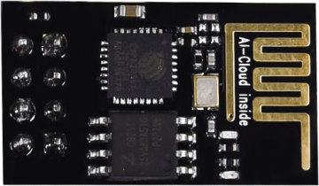
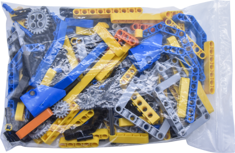
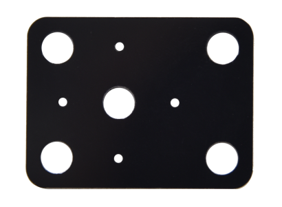
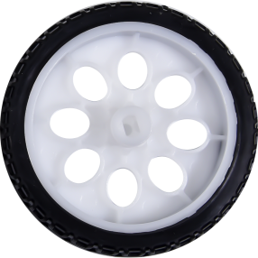
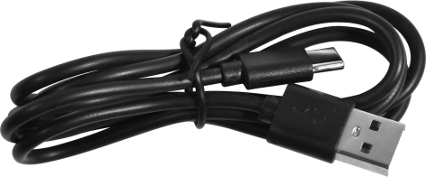
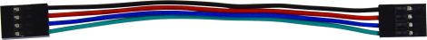
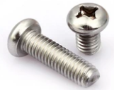
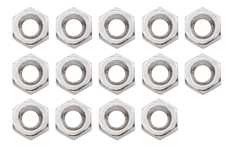
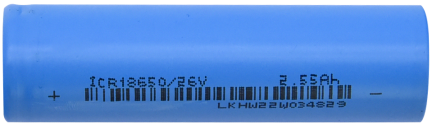
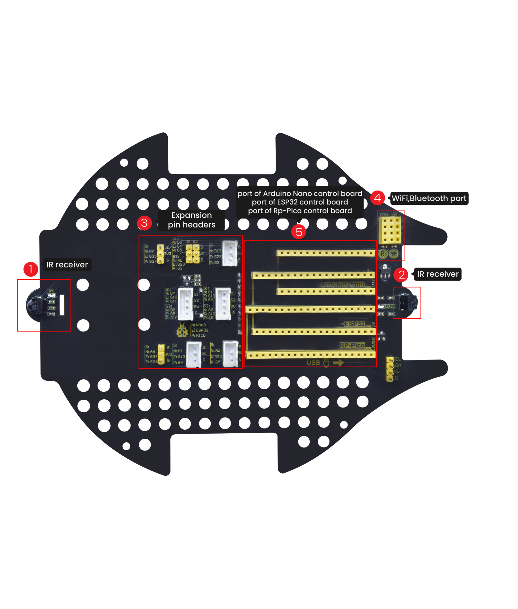

# **Beetlebot 3 in 1 Robot for Pico**

## Download Resources:

[https://fs.keyestudio.com/KS3027](https://fs.keyestudio.com/KS3027)

## Decription：

The Beetlebot smart robot, compatible with LEGO building blocks, is a STEM educational product which can automatically dodge obstacles, follow black lines and light to move. Besides, it has three cool forms such as the soccer robot, the siege robot, the handling robot. As for beginners, they cancreate whatever they want by LEGO building blocks.

Various improvements have been made on the Beetlebot car in comparison with other smart cars. It integrates a motor driver and a large number ofsensors and is easy to assemble. Beetlebot's control core is today's mainstream open source hardware, which allows it to implement low-cost programming learning programs.

Going forward, not only can it impart basic programming knowledge and AI application to children and the youth, but also it can cultivate their creativity, hands-on ability, problem-solving capability, interpersonal communication as well as teamwork ability. With this kit, you have a chance to experience soccer games using your own robots.

## Features：

-   Compatible with LEGO building blocks: generate diverse forms with LEGO blocks and sensors
-   Three forms: a soccer robot, a siege engine, a handling robot
-   Various functions: Pictures display, atmosphere light control, line tracking, obstacle avoidance, light following , IR control and WIFI control.
-   Easy to build: embedded design on car body; wire up the car body with a few steps
-   High compatibility: reserve ports for the Arduino Nano board and the ESP32 control board
-   Charging function: integrate a circuit for 18650 batteries, low-cost and effective
-   WiFi Control: adopt WiFi control, can finish tailor-made software development
-   App: compatible with Android and iOS systems, with aesthetic page and flexible control system

## Specification：

Working voltage: 5V

Input voltage: 2.5V\~4.2V (lithium battery)

Maximum output current: 3A

Maximum power consumption: 15W (T=80℃)

Motor speed: 5V 200 rpm / min

Motor drive form: dual H-bridge

Ultrasonic sensing angle: \<15 degrees

Ultrasonic detection distance: 2cm-400cm

IR control distance: about 7 meters (measured)

Size: 176mm\*137mm\*130mm

Environmental protection attributes: ROHS

## Kit List：

| \# | Picture                                                                                             | Name                                                                                                                                                                                                                                                                                                                                                                                                                                                                                                                                                                                                                                                                                                                                                                                                                                                                                                                                                                                                                                                                                                                                                                                    | QTY |
|----|-----------------------------------------------------------------------------------------------------|-----------------------------------------------------------------------------------------------------------------------------------------------------------------------------------------------------------------------------------------------------------------------------------------------------------------------------------------------------------------------------------------------------------------------------------------------------------------------------------------------------------------------------------------------------------------------------------------------------------------------------------------------------------------------------------------------------------------------------------------------------------------------------------------------------------------------------------------------------------------------------------------------------------------------------------------------------------------------------------------------------------------------------------------------------------------------------------------------------------------------------------------------------------------------------------------|-----|
|    |                                                      |  Raspberry Pi  Pico Board                                                                                                                                                                                                                                                                                                                                                                                                                                                                                                                                                                                                                                                                                                                                                                                                                                                                                                                                                                                                                                                                                                                                                               | 1   |
|    |                                                    | ESP8266 Wifi Module                                                                                                                                                                                                                                                                                                                                                                                                                                                                                                                                                                                                                                                                                                                                                                                                                                                                                                                                                                                                                                                                                                                                                                     | 1   |
|    |                                                 | Keyestudio Photoresistor                                                                                                                                                                                                                                                                                                                                                                                                                                                                                                                                                                                                                                                                                                                                                                                                                                                                                                                                                                                                                                                                                                                                                                | 2   |
|    |                                                    | 270° Servo                                                                                                                                                                                                                                                                                                                                                                                                                                                                                                                                                                                                                                                                                                                                                                                                                                                                                                                                                                                                                                                                                                                                                                              | 1   |
|    |                                                    | Keyestudio Development  Board                                                                                                                                                                                                                                                                                                                                                                                                                                                                                                                                                                                                                                                                                                                                                                                                                                                                                                                                                                                                                                                                                                                                                           | 1   |
|    |                                                    | Keyestudio  Driver Board                                                                                                                                                                                                                                                                                                                                                                                                                                                                                                                                                                                                                                                                                                                                                                                                                                                                                                                                                                                                                                                                                                                                                                | 1   |
|    |                                                    | LEGO Bulk Lot                                                                                                                                                                                                                                                                                                                                                                                                                                                                                                                                                                                                                                                                                                                                                                                                                                                                                                                                                                                                                                                                                                                                                                           | 1   |
|    |                                                    | Acrylic Board                                                                                                                                                                                                                                                                                                                                                                                                                                                                                                                                                                                                                                                                                                                                                                                                                                                                                                                                                                                                                                                                                                                                                                           | 1   |
|    |                                                    | MD0487 Acrylic Board for Ultrasonic Sensor                                                                                                                                                                                                                                                                                                                                                                                                                                                                                                                                                                                                                                                                                                                                                                                                                                                                                                                                                                                                                                                                                                                                              | 1   |
|    |                                                     | Acrylic Board for Servo                                                                                                                                                                                                                                                                                                                                                                                                                                                                                                                                                                                                                                                                                                                                                                                                                                                                                                                                                                                                                                                                                                                                                                 | 1   |
|    |                                                     | 4.5V 200R Motor                                                                                                                                                                                                                                                                                                                                                                                                                                                                                                                                                                                                                                                                                                                                                                                                                                                                                                                                                                                                                                                                                                                                                                         | 2   |
|    |                                                    | 8\*8 Dot Matrix Display                                                                                                                                                                                                                                                                                                                                                                                                                                                                                                                                                                                                                                                                                                                                                                                                                                                                                                                                                                                                                                                                                                                                                                 | 1   |
|    |                                                     |  Aluminum Block | 2   |
|    |                                                    | 9G 180°Servo                                                                                                                                                                                                                                                                                                                                                                                                                                                                                                                                                                                                                                                                                                                                                                                                                                                                                                                                                                                                                                                                                                                                                                            | 1   |
|    |                                                    | Car Wheel                                                                                                                                                                                                                                                                                                                                                                                                                                                                                                                                                                                                                                                                                                                                                                                                                                                                                                                                                                                                                                                                                                                                                                               | 2   |
|    |                                                     | HC-SR04 Ultrasonic Sensor                                                                                                                                                                                                                                                                                                                                                                                                                                                                                                                                                                                                                                                                                                                                                                                                                                                                                                                                                                                                                                                                                                                                                               | 1   |
|    |                                                    |  Screwdriver    | 1   |
|    |                                                     | W420 Universal Wheel                                                                                                                                                                                                                                                                                                                                                                                                                                                                                                                                                                                                                                                                                                                                                                                                                                                                                                                                                                                                                                                                                                                                                                    | 1   |
|    |                                              | JMFP-4 17-Key Remote Control                                                                                                                                                                                                                                                                                                                                                                                                                                                                                                                                                                                                                                                                                                                                                                                                                                                                                                                                                                                                                                                                                                                                                            | 1   |
|    |                                                     | Black USB Cable                                                                                                                                                                                                                                                                                                                                                                                                                                                                                                                                                                                                                                                                                                                                                                                                                                                                                                                                                                                                                                                                                                                                                                         | 1   |
|    |                                                | Screwdriver                                                                                                                                                                                                                                                                                                                                                                                                                                                                                                                                                                                                                                                                                                                                                                                                                                                                                                                                                                                                                                                                                                                                                                             | 1   |
|    |                                                     | 3P F-F Dupont Wire                                                                                                                                                                                                                                                                                                                                                                                                                                                                                                                                                                                                                                                                                                                                                                                                                                                                                                                                                                                                                                                                                                                                                                      | 2   |
|    |                                                     | 4P F-F Dupont Wire                                                                                                                                                                                                                                                                                                                                                                                                                                                                                                                                                                                                                                                                                                                                                                                                                                                                                                                                                                                                                                                                                                                                                                      | 1   |
|    |                                                     | HX2.54mm-4P Dupont Wire                                                                                                                                                                                                                                                                                                                                                                                                                                                                                                                                                                                                                                                                                                                                                                                                                                                                                                                                                                                                                                                                                                                                                                 | 1   |
|    |                                             | Winding Pipe                                                                                                                                                                                                                                                                                                                                                                                                                                                                                                                                                                                                                                                                                                                                                                                                                                                                                                                                                                                                                                                                                                                                                                            | 1   |
|    |                                                    | 10P XH2.54 Dupont Wire                                                                                                                                                                                                                                                                                                                                                                                                                                                                                                                                                                                                                                                                                                                                                                                                                                                                                                                                                                                                                                                                                                                                                                  | 1   |
|    |                                                    | Acrylic Gasket                                                                                                                                                                                                                                                                                                                                                                                                                                                                                                                                                                                                                                                                                                                                                                                                                                                                                                                                                                                                                                                                                                                                                                          | 6   |
|    |                                                    | M3\*40MM Dual Pass Copper Pillars                                                                                                                                                                                                                                                                                                                                                                                                                                                                                                                                                                                                                                                                                                                                                                                                                                                                                                                                                                                                                                                                                                                                                       | 4   |
|    |                                                    | M1.2\*5MM Round Head Screws                                                                                                                                                                                                                                                                                                                                                                                                                                                                                                                                                                                                                                                                                                                                                                                                                                                                                                                                                                                                                                                                                                                                                             | 6   |
|    |   | M1.4 Nuts                                                                                                                                                                                                                                                                                                                                                                                                                                                                                                                                                                                                                                                                                                                                                                                                                                                                                                                                                                                                                                                                                                                                                                               | 6   |
|    |                                                      | M1.4\*10MM Round Head Screws                                                                                                                                                                                                                                                                                                                                                                                                                                                                                                                                                                                                                                                                                                                                                                                                                                                                                                                                                                                                                                                                                                                                                            | 6   |
|    |                                                    | M2 Nuts                                                                                                                                                                                                                                                                                                                                                                                                                                                                                                                                                                                                                                                                                                                                                                                                                                                                                                                                                                                                                                                                                                                                                                                 | 3   |
|    |                                                    | M2\*8MM Round Head Screws                                                                                                                                                                                                                                                                                                                                                                                                                                                                                                                                                                                                                                                                                                                                                                                                                                                                                                                                                                                                                                                                                                                                                               | 3   |
|    |   | M3\*10MM Round Head Screws                                                                                                                                                                                                                                                                                                                                                                                                                                                                                                                                                                                                                                                                                                                                                                                                                                                                                                                                                                                                                                                                                                                                                              | 6   |
|    |                                                      | M3\*6MM Round Head Screws                                                                                                                                                                                                                                                                                                                                                                                                                                                                                                                                                                                                                                                                                                                                                                                                                                                                                                                                                                                                                                                                                                                                                               | 11  |
|    |                                                    | M3 Nuts                                                                                                                                                                                                                                                                                                                                                                                                                                                                                                                                                                                                                                                                                                                                                                                                                                                                                                                                                                                                                                                                                                                                                                                 | 9   |
|    |                                                    | M3\*30MM Round Head Screws                                                                                                                                                                                                                                                                                                                                                                                                                                                                                                                                                                                                                                                                                                                                                                                                                                                                                                                                                                                                                                                                                                                                                              | 4   |
|    |                                                     | Soccer Ball                                                                                                                                                                                                                                                                                                                                                                                                                                                                                                                                                                                                                                                                                                                                                                                                                                                                                                                                                                                                                                                                                                                                                                             | 1   |
|    |                                                    | W1515 Universal Wheel                                                                                                                                                                                                                                                                                                                                                                                                                                                                                                                                                                                                                                                                                                                                                                                                                                                                                                                                                                                                                                                                                                                                                                   | 1   |
|    |                                                    | 18650 Batteries KS3027F includes batteries KS3027 doesn't conclude batteries                                                                                                                                                                                                                                                                                                                                                                                                                                                                                                                                                                                                                                                                                                                                                                                                                                                                                                                                                                                                                                                                                                            | 1   |
|    |                                               |  USB to ESP-01S WIFI Module Expansion Board                                                                                                                                                                                                                                                                                                                                                                                                                                                                                                                                                                                                                                                                                                                                                                                                                                                                                                                                                                                                                                                                                                                                             | 1   |
|    |                | USB Cable                                                                                                                                                                                                                                                                                                                                                                                                                                                                                                                                                                                                                                                                                                                                                                                                                                                                                                                                                                                                                                                                                                                                                                               | 1   |

## Raspberry Pi Pico Board: 

 

 **1. Introduction:** 

Raspberry Pi Pico is a low-cost, high-performance microcontroller board with flexible digital interfaces. It integrates the RP2040 microcontroller chip designed by Raspberry Pi, with dual-core Arm Cortex M0+ processor running up to 133 MHz, embedded 264KB of SRAM and 2MB of on-board Flash memory, as well as 26 multi-function GPIO pins. For software development, either Raspberry Pi's C/C++ SDK, or the MicroPython is available. In this tutorial, we provide you with corresponding tutorials in MicroPython. 

 

 **2. Features:** 

※ RP2040 microcontroller chip designed by Raspberry Pi

※ Dual-core ARM Cortex M0+ processor, flexible clock running up to 133 MHz

※ 264kB of SRAM, and 2MB of on-board Flash memory

※ Castellated module allows soldering direct to carrier boards

※ USB 1.1 Host and device support

※ Low-power sleep and dormant modes

※ Drag & drop programming using mass storage over USB

※ 26 multi-function GPIO pins

※ 2×SPI, 2×I2C, 2×UART, 3×12-bit ADC, 16×controllable PWM channels

※ Accurate on-chip clock and timer

※ Temperature sensor

※ Accelerated floating point libraries on-chip

※ 8×Programmable IO (PIO) state machines for custom peripheral support

 

 **3. Parameters:** 

- MCU: RP2040 microcontroller chip 
- CPU: Dual-core Arm Cortex-M0+ @ 133MHz 
- USB-to-serial chip: Built-in USB1.1 PHY host and device support, drag-and-drop download program through USB identification as mass storage 
- Working voltage: 3.0V-3.6V 
- Working current: average 80mA 
- Supply current: 500mA 
- External power supply: DC power supply is 6-12V (recommended 9V), USB power supply is 5V. 
- Flash Memory: Built-in 2MB 
- SRAM: Built-in 264KB 
- Integrated crystal oscillator: 12MHz

- **Dimensions: **

  

 **4. Schematic Diagram:** 

 **5. Pin Out**

| PIN            | FUNCTION                                                     |
| -------------- | ------------------------------------------------------------ |
| GND            | Ground pin                                                   |
| Power          | VBUS(microUSB voltage), VSYS(2-5VDC input voltage), 3V3(3.3V output voltage) 3V3_EN(Enables Pico) |
| System Control | run (enable or disable the RP2040 microcontroller or reset)  |
| ADC            | Raspberry Pi Pico has a total of 5 ADCs with a resolution of 12 bits, namely ADC0 (GP26), ADC1 (GP27), ADC2 (GP28), ADC3 (GP29), ADC4.  Among them, ADC3 (GP29) is used to measure VSYS on the Pico board; ADC4 is directly connected to the built-in temperature sensor of RP2040. ADC_VREF can be connected to an external accurate voltmeter as ADC reference. The ADC_GND pin serves as the ground reference. |
| PWM            | Raspberry Pi Pico has 16 PWM channels，each of channel can control frequency and duty cycle.GPIO pin is switched to PWM |
| UART           | Two UART： UART0,UART1                                       |
| I2C            | Two types of I2C： I2C0 I2C1                                 |
| SPI            | Two types of SPI：SPI0,SPI1                                  |
| Debugging      | used in debugging code                                       |

**Related information:** <https://datasheets.raspberrypi.com/pico/pico-datasheet.pdf>

## PCB Board:

****

**Note: Switch the DIP switch to OFF before removing or installing the battery.**

